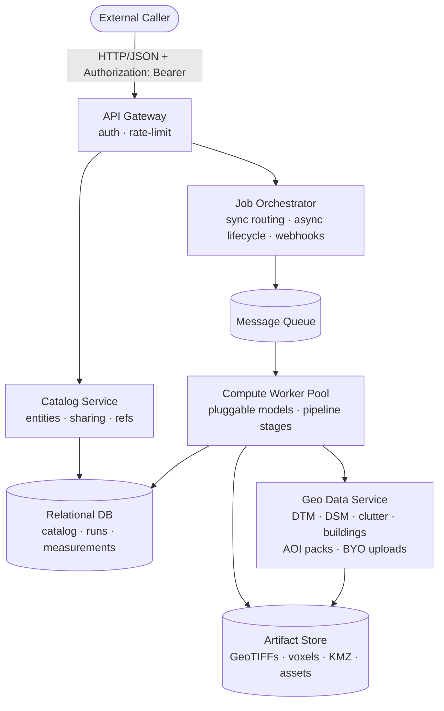
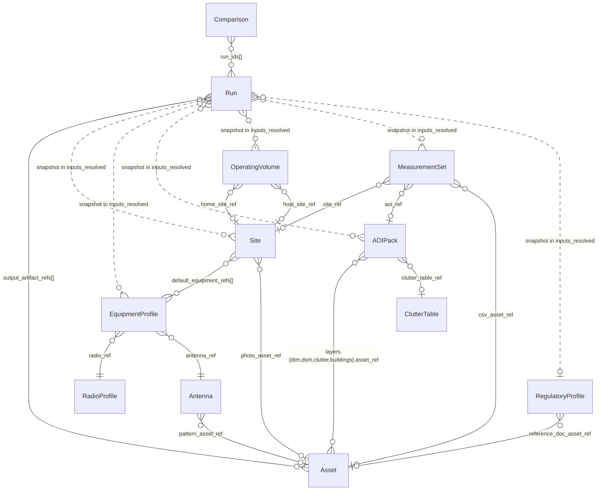
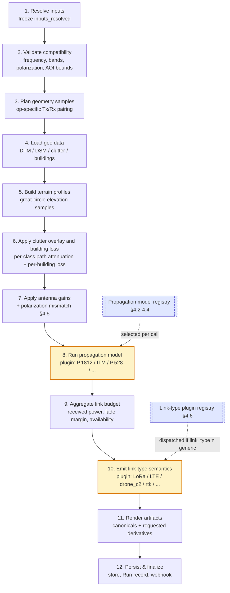
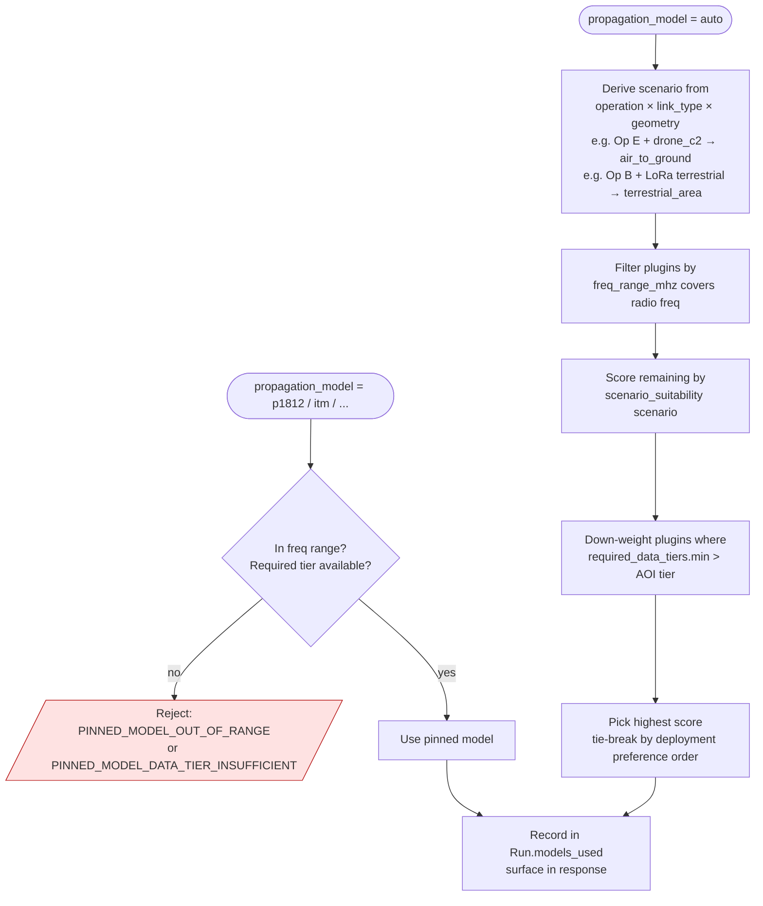
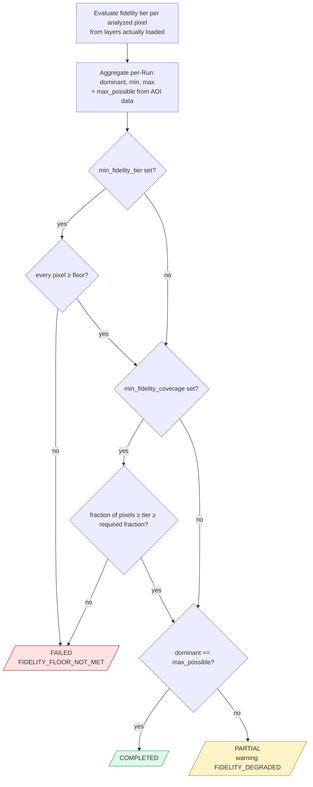
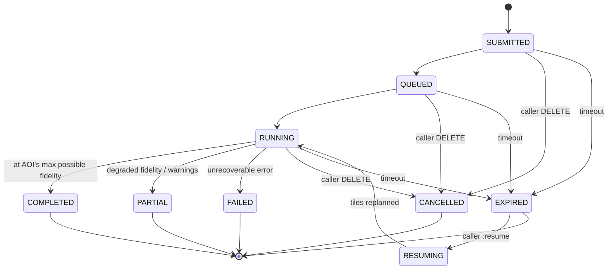
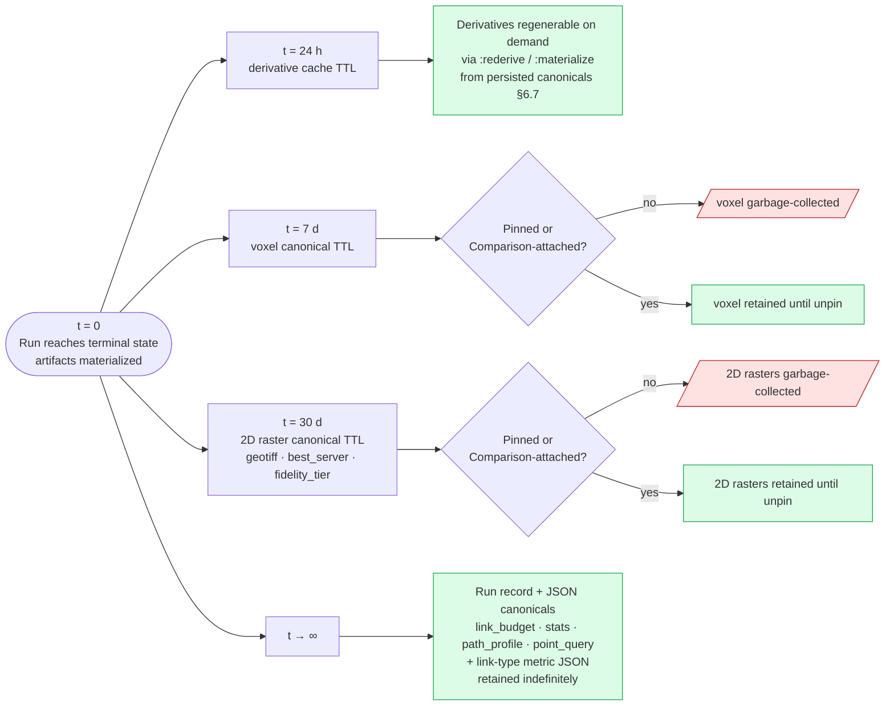

# RF Site Planning API — Design Specification

**Date:** 2026-04-25
**Status:** Draft v3 — ready to implement
**Architecture approach:** Pluggable model registry + pipeline-stage engine
**Revision note:** v2 incorporates Tx/Rx frequency authority, three-tier fidelity reporting, content-addressed assets, canonical-vs-derivative artifact model, per-class retention, and an explicit error/warning catalog. See change log at end.

---

## 1. Purpose & Scope

### Purpose

A self-hosted, single-tenant API service that performs RF propagation analysis for site planning. The system targets field engineers placing **autonomous drone docks**, **sub-GHz IoT endpoints** (e.g., camera traps, fence/gate sensors, animal collars), **LoRa gateways**, **GNSS RTK base stations**, and **LTE backhaul equipment** in remote/protected areas. Wildlife-protection deployments are the primary driver of v1 design — see worked examples — but no spec primitive is wildlife- or vendor-specific. Representative questions the system answers:

- "From this candidate gateway site, what's the LoRa coverage to the IoT-sensor network in this AOI?"
- "Will the 2.4 GHz drone C2 link hold across this flight envelope at 60–120 m AGL?"
- "Of these five candidate dock sites, which gives the best combined LoRa + LTE + RTK coverage?"
- "Does observed RSSI at deployed sensors match what we predicted six months ago?"

### In scope

- Predictive RF coverage and link-budget computation across:
  - LoRa (sub-GHz ISM, 868/915 MHz)
  - LTE (600 MHz–3.5 GHz)
  - 2.4/5.8 GHz drone C2/video
  - GNSS RTK correction links
- Five analysis operations: point-to-point, area heatmap, multi-link site report, multi-Tx best-server, 3D/volumetric coverage.
- Adaptive geo-data fidelity (terrain only → DTM+clutter → DSM → DSM+buildings).
- Field-measurement storage and predicted-vs-observed reporting.
- Self-hosted, Docker-packaged deployment with a fully offline local mode.
- Standard profile library and global baseline geo-data shipped with the system.

### Out of scope (v1)

- Real-time spectrum analysis.
- Real-time / streaming measurement ingest (batch and chunked-append only).
- Network optimization beyond point-to-point (frequency planning, interference management).
- Regulatory licensing tooling.
- A first-party web UI (a thin reference client may exist but is not the product).
- Automatic model self-calibration. Measurement storage and predicted-vs-observed reporting are in scope; using measurements to bias models is deferred.
- 6 GHz / 60 GHz unlicensed bands (Wi-Fi 6E/7, 802.11ay).

### System context

The API is the only product surface. Callers are:
- Operational tools driven by field engineers.
- Automation pipelines (e.g., a deployment-planning workflow that scores candidate sites).
- Ad-hoc scripts.

All callers authenticate with an API key. Single-tenant deployment with multiple keys per tenant; per-entity sharing flags grant cross-key visibility within the tenant.

### Global conventions

- All timestamps are RFC 3339 UTC (e.g., `2026-04-25T14:00:00Z`).
- Frequencies are MHz unless field name specifies otherwise (`_khz`, `_ghz`).
- Altitudes carry an explicit `altitude_reference: "agl" | "amsl"`.
- Distances are meters unless field name specifies otherwise (`_km`).
- Powers and gains are dB-domain (dBm absolute, dB relative, dBi for antenna gain).
- All hashes are SHA-256, lowercase hex, prefixed `sha256:` when used as identifiers.

---

## 2. Service Topology & API Contract

### 2.1 Service topology

The system is composed of cooperating services, packaged together as a Docker Compose stack for local/edge deployment and orchestrated for scaled deployment using the same images.



### 2.2 Deployment shape

- All services are packaged as one Docker Compose stack for local/edge use (laptop, field box). The same images are orchestrated for scaled deployment.
- A bundled global baseline (DTM at SRTM-30-class resolution, coarse global land-cover) and the standard profile library (default antennas, radio profiles, equipment profiles, system ClutterTables) are seeded on first boot of the catalog DB and geo store.
- Local mode is fully offline-capable once seeded.

### 2.3 API contract shape

- **Style.** REST, resource-oriented, JSON. OpenAPI-described. Versioned URL prefix (`/v1`).
- **Auth.** API key in the standard `Authorization: Bearer <api-key>` header (per [ADR-0002 §2](../../adr/0002-argus-alignment-and-auth.md); keys are stored as argon2id hashes with an 8-character prefix index). Multiple keys per tenant; sharing flag per catalog entity grants visibility across keys within the tenant. Auth is implemented behind a pluggable adapter interface (§8.4); v1 ships only the bearer-key adapter.
- **Mode selection.** Each analysis endpoint accepts `mode=sync|async|auto` (default `auto`). When `auto`, the orchestrator selects `async` if any of:
  - `operation ∈ {area, multi_link, multi_tx, voxel}`,
  - estimated output cell count > `auto_async_cell_threshold` (default **250,000**),
  - declared geometry exceeds `auto_async_area_km2` (default **100**).
  
  The chosen mode is echoed as `mode_executed` in the response and recorded on the Run record.
- **Sync budget.** Sync responses are bounded by `sync_budget_seconds` (default **25**, kept under typical proxy/ALB timeouts). On overrun the run is auto-promoted to async and the response returns `202 {run_id, status_url, mode_executed: "async", reason: "sync_budget_exceeded"}`. Async responses always return `{run_id, status_url, mode_executed: "async", optional webhook_url}`.
- **Reference shape.** Any field that names a catalog entity (Site, Radio Profile, Antenna, Equipment Profile, AOI Pack, Operating Volume, Measurement Set, ClutterTable, Comparison) accepts either a reference or a fully inlined object. Reference shape:
  ```
  { ref: <name>, owner?: "self" | "shared", version?: <int> | "latest" }
  ```
  Defaults: `owner = "self"`, `version = "latest"`. Cross-key references (`owner = "<key-id>"`) are **not** supported in v1; sharing is governed only by the entity's `share` flag (`private` | `shared`). Inlined objects are NOT persisted to the catalog. Mixed forms are allowed in the same request.
- **Output selection.** Each analysis request includes an `outputs` array declaring which artifacts to produce (e.g., `["link_budget", "geotiff", "geojson_contours", "kmz", "stats"]`). The engine produces only what is requested. Derivatives (§6) are produced eagerly on submit and may also be produced on demand later from the persisted canonicals (§8.9).
- **Idempotency.** Run submissions accept `Idempotency-Key`:
  - Same key + same key_id + byte-equal body → returns the original Run in whatever terminal state it reached (including FAILED, CANCELLED, EXPIRED).
  - Same key + same key_id + different body → `422 IDEMPOTENCY_KEY_BODY_MISMATCH` with the original Run id in the response.
  - Same key + different key_id → treated as unrelated.
  - Keys are remembered for `idempotency_window_days` (default **7**); subsequent reuse creates a new Run.
- **Error & warning model.** Standard problem-detail JSON; codes enumerated in Appendix D. Runs that succeed at degraded data fidelity return `warnings[]` and status `PARTIAL`; runs at the AOI's maximum possible fidelity return `COMPLETED`.
- **Pagination & filtering.** List endpoints (sites, antennas, runs, etc.) paginate with cursors and filter by name, owner, share-state, tag.

The mode-selection flow, including the auto-promotion of an overrunning sync request to async:

```mermaid
sequenceDiagram
    autonumber
    actor Caller
    participant API as API Gateway / Orchestrator
    participant Worker

    Caller->>API: POST /v1/analyses/{op} {mode, ...}

    alt resolves to async (requested or auto-selected)
        API-->>Caller: 202 {run_id, status_url, mode_executed: async, reason: requested}
        API->>Worker: enqueue
        Worker-->>API: terminal state
        opt webhook_url present
            API-)Caller: POST <webhook_url> (HMAC-signed)
        end
    else sync, completes within sync_budget_seconds
        API->>Worker: enqueue
        Worker-->>API: terminal state (under 25 s)
        API-->>Caller: 200 {Run record, mode_executed: sync}
    else sync, exceeds sync_budget_seconds
        API->>Worker: enqueue
        Note over API,Worker: 25 s elapses; run still RUNNING
        API-->>Caller: 202 {run_id, status_url, mode_executed: async,<br/>reason: sync_budget_exceeded}
        Worker-->>API: terminal state (run continues normally)
    end
```

### 2.4 Webhooks

- Async submissions MAY include `webhook_url`. The orchestrator POSTs to it on terminal-state transitions.
- Payload: `{run_id, status, signed_at, artifacts_url, warnings, error}`. `signed_at` is RFC 3339 UTC.
- **Signing.** Header `X-Signature: HMAC-SHA256(secret, signed_at + "." + body)` where `body` is the **exact bytes the receiver gets** off the wire — receivers MUST NOT re-canonicalize, re-serialize, or otherwise normalize the payload before computing the HMAC, as proxies that re-emit JSON with different whitespace, key ordering, or numeric forms invalidate the signature. To keep signatures stable across proxies, servers MUST emit webhook payload bodies as **compact JSON** (no insignificant whitespace, UTF-8, no trailing newline). Receivers MUST reject `signed_at` deltas > 5 minutes from local time.
- **Registration challenge.** First time a `webhook_url` is seen for a tenant, the orchestrator POSTs `{challenge: <random>}` and requires the URL to echo it back within 5 seconds. URLs that fail challenge are rejected. Subsequent submissions to a verified URL skip the challenge for `webhook_verification_ttl_days` (default **30**).
- **Secret rotation.** `POST /v1/webhooks/secrets:rotate` produces a new secret. Both old and new are accepted for **24 h** so receivers can roll over without downtime.
- Delivery retried with exponential backoff on non-2xx for a bounded window (default 6 attempts over 1 hour).
- **Sensitivity-class gating.** Webhook delivery for runs at `restricted_species` requires the target URL to be on the deployment's `opsec_authorized` allowlist (Appendix E.2). Webhooks for `location_redacted` runs deliver normally, but per-artifact URLs in the payload serve redacted variants per Appendix E.2.

### 2.5 Endpoint inventory

| Method | Path | Sync/Async | Required scope |
|---|---|---|---|
| `POST` `GET` `PATCH` `DELETE` | `/v1/sites` (and `/{id}`) | sync | `catalog.*` |
| `POST` `GET` `PATCH` `DELETE` | `/v1/antennas` (and `/{id}`) | sync | `catalog.*` |
| `POST` `GET` `PATCH` `DELETE` | `/v1/radio-profiles` (and `/{id}`) | sync | `catalog.*` |
| `POST` `GET` `PATCH` `DELETE` | `/v1/equipment-profiles` (and `/{id}`) | sync | `catalog.*` |
| `POST` `GET` `PATCH` `DELETE` | `/v1/aoi-packs` (and `/{id}`) | sync (create may be async) | `catalog.*` |
| `POST` `GET` `PATCH` `DELETE` | `/v1/clutter-tables` (and `/{id}`) | sync | `catalog.*` |
| `POST` `GET` `PATCH` `DELETE` | `/v1/operating-volumes` (and `/{id}`) | sync | `catalog.*` |
| `POST` `GET` `PATCH` `DELETE` | `/v1/measurements` (and `/{id}`) | sync | `measurements.*` |
| `POST` | `/v1/measurements/{id}:append` | sync | `measurements.write` |
| `POST` `GET` `PATCH` `DELETE` | `/v1/comparisons` (and `/{id}`) | sync | `catalog.*` |
| `POST` `GET` `PATCH` `DELETE` | `/v1/regulatory-profiles` (and `/{id}`) | sync | `catalog.*` |
| `POST` | `/v1/assets:initiate` | sync | `catalog.write` |
| `POST` | `/v1/assets/{id}:complete` | sync | `catalog.write` |
| `POST` | `/v1/assets/{id}:abort` | sync | `catalog.write` |
| `GET` | `/v1/assets/{id}` (metadata) | sync | `catalog.read` |
| `POST` | `/v1/analyses/p2p` | sync (default) | `runs.submit` |
| `POST` | `/v1/analyses/area` | sync or async | `runs.submit` |
| `POST` | `/v1/analyses/multi_link` | sync or async | `runs.submit` |
| `POST` | `/v1/analyses/multi_tx` | sync or async | `runs.submit` |
| `POST` | `/v1/analyses/voxel` | async (default) | `runs.submit` |
| `GET` | `/v1/runs/{id}` | sync | `runs.read` |
| `GET` | `/v1/runs/{id}/status` | sync | `runs.read` |
| `DELETE` | `/v1/runs/{id}` (cancel) | sync | `runs.cancel` |
| `POST` | `/v1/runs/{id}/replay` | sync or async | `runs.submit` |
| `POST` | `/v1/runs/{id}/pin` `…/unpin` | sync | `runs.write` |
| `GET` | `/v1/runs/{id}/artifacts/{key}` (metadata) | sync | `runs.read` |
| `GET` | `/v1/runs/{id}/artifacts/{key}/url` (refresh) | sync | `runs.read` |
| `POST` | `/v1/runs/{id}/artifacts/{key}:materialize` | sync | `runs.read` |
| `POST` | `/v1/runs/{id}/artifacts:rederive` | sync | `runs.read` |
| `GET` | `/v1/runs/{id}/artifacts/voxel/slice` | sync | `runs.read` |
| `POST` `GET` `DELETE` | `/v1/webhooks` (and `/{id}`) | sync | `admin` |
| `POST` | `/v1/webhooks/secrets:rotate` | sync | `admin` |
| `GET` | `/healthz` `/readyz` `/metrics` | sync | (none) |

---

## 3. Catalog Data Model

### 3.1 Identity, sharing, versioning

- **Natural key:** `(owner_api_key, name, entity_type)`.
- **Stable internal ID:** survives renames; used in references that should not break on rename.
- **Sharing:** every entity has a `share` flag with values `private` (default — visible only to the creating key) or `shared` (readable by any key in the tenant; only the owner can write). Cross-key referencing by key id is not supported.
- **Versioning:** Antenna, Radio Profile, Equipment Profile, Site, AOI Pack, ClutterTable, Operating Volume, and Measurement Set version on edit. References can pin to a specific version (`version: <int>`) or float to `"latest"`. Runs always resolve to a specific version, recorded in `Run.inputs_resolved`.
- **`inputs_resolved` freeze point:** frozen at the SUBMITTED transition, after orchestrator validation, before QUEUED. Catalog edits after the freeze point have no effect on the in-flight run. The exact freeze time is recorded on the Run as `inputs_resolved_at`.
- **Soft delete:** deletes mark records hidden but do not break runs that reference them. Soft-deleted shared entities are hidden from list endpoints and return `404` on `GET` by name; resolution by stable internal ID continues to work for in-flight runs and historical `inputs_resolved`. Hard delete only via explicit purge.
- **Tags:** free-form tags on Site, AOI Pack, Equipment Profile, Operating Volume, Comparison.

### 3.2 First-class entities (10 total)

> **Inlining surface in analysis requests.** Seven of the ten entities — Site, Antenna, RadioProfile, EquipmentProfile, AOIPack, OperatingVolume, RegulatoryProfile — accept either a `Reference` or a fully inlined object inside an analysis request body (the `RefOrInlineX` shapes in the JSON Schema). The other three — **ClutterTable**, **MeasurementSet**, and **Comparison** — are deliberately reference-only at analysis-request time: ClutterTable is reached transitively via `AOIPack.clutter_table_ref` (or via inlining the AOIPack); MeasurementSet is reached via `measurement_set_refs[]` on `AnalysisCommon` and is too large to inline efficiently; Comparison is composed *from* completed Runs and never appears in an analysis request body. This is why the JSON Schema defines seven `InlineX` shapes, not ten.


| Entity | Required fields | Notable optional fields | Purpose |
|---|---|---|---|
| **Site** | `name`, `lat`, `lon` | `ground_elevation_override_m`, `default_equipment_refs[]`, `notes`, `tags[]`, `photo_asset_ref` | Named geographic point. `default_equipment_refs[]` lists Equipment Profiles intended to be deployed at this site (e.g., a LoRa gateway + LTE backhaul + RTK base + 2.4 GHz drone C2 colocated at one tower). Op C uses these by default; analysis requests may override. |
| **Radio Profile** | `name`, `link_type` (string; `generic` is built-in, additional values registered by link-type plugins — see §4.6), `freq_mhz`, `bandwidth_khz`, `tx_power_dbm`, `rx_sensitivity_dbm` | Per-plugin extension fields. Bundled plugins ship `lora` (`spreading_factor`, `coding_rate`), `lte` (`band`, `earfcn`), `drone_c2` (`mode_label`), `rtk` (`mode_label`); each plugin's contract names the fields it consumes. Plus `modulation`, `fade_margin_db_target` (used by `generic`), `propagation_model_pref` (auto / explicit). | RF parameters; antenna-agnostic. |
| **Antenna** | `name`, `kind` (`parametric` / `pattern_file`), `gain_dbi`, `polarization`, `applicable_bands: [{min_mhz, max_mhz}, …]` | `applicable_polarizations[]`. Parametric: `pattern_type` (omni / sector), `h_beamwidth_deg`, `v_beamwidth_deg`, `electrical_downtilt_deg`. File: `format` (msi/adf/ant/csv), `pattern_asset_ref`. | Antenna spec; orientation comes from Equipment. The engine warns (`MODEL_OUT_OF_NOMINAL_FREQ`) at use within ±10 % of the declared band edge and fails (`ANTENNA_OUT_OF_BAND`) at >25 %. |
| **Equipment Profile** | `name`, `radio_ref`, `antenna_ref`, `mount_height_m_agl`, `cable_loss_db` | `cable_loss_curve: [{freq_mhz, loss_db}]` (overrides scalar via piecewise-linear interpolation), `azimuth_deg`, `mechanical_downtilt_deg`, `mfr`, `model`, `notes` | Deployable bundle of radio + antenna + mounting. `cable_loss_db` is evaluated at the bound radio's center frequency. |
| **AOI Pack** | `name`, `bbox` (south, west, north, east) | `layers: { dtm: AOILayer, dsm: AOILayer, clutter: AOILayer, buildings: AOILayer }` (each `AOILayer` carries `source` ∈ `bundled/byo/fetched`, `asset_ref`, `upstream_source`, `upstream_version`, `acquired_at`, `content_sha256`, `resolution_m`); plus pack-level `clutter_table_ref`, `resolution_m`, `notes`, `tags[]` | Region with attached geo-data layers. Per-layer provenance fields (§5.3). |
| **ClutterTable** | `name`, `taxonomy_id`, `class_table` (mapping class_id → `{label?, attenuation_db_per_band: {anchor_freq_mhz_str → dB per 100 m of path}, depolarization_factor: 0..1, notes?}`) | `applicable_freq_bands`, profile-level `notes` | Per-class attenuation table. Per-class `depolarization_factor` is consumed by polarization mismatch (§4.5). The engine accumulates attenuation linearly along path segments and interpolates linearly in dB between declared anchor frequencies; outside the anchor range it falls back to the nearest anchor. |
| **Operating Volume** | `name`, `bbox` *or* `polygon`, `altitude_min_m`, `altitude_max_m`, `altitude_reference` | `altitude_step_m`, `duration_estimate_min`, `home_site_ref`, `host_site_ref`, `notes` | A 3D region of interest for volumetric coverage analysis. Drone-flight-envelope is the primary use case (Op E with `home_site_ref` pointing at the drone dock or launch site); also covers tower vertical-pattern surveys, tethered-balloon links, and any other case needing per-altitude evaluation. Altitudes pair with the entity-level `altitude_reference` (`agl` \| `amsl`). `home_site_ref` names a return-to-home / launch-recovery anchor (drone-specific semantics). `host_site_ref` names the operational anchor for non-recovering deployments. Both are optional and orthogonal — typically the same Site, sometimes different, sometimes neither. |
| **Measurement Set** | `name`, `points[]` where each `= {lat, lon, altitude_m, altitude_reference, freq_mhz, observed_signal_dbm, observed_metric, timestamp, source}` | `ordered: bool` (default `false`; tracks set this `true`), per-point `seq: int` (when `ordered`), `device_ref`, `site_ref` *or* `aoi_ref`, `sensitivity_class` (Appendix E), `notes`, per-point `bandwidth_khz`, `uncertainty_db`, `tags` | Stored field RSSI/RSRP observations. A point cloud (camera traps) by default; tracks set `ordered: true` and supply `seq` per point. |
| **Comparison / Plan** | `name`, `run_ids[]` | `notes`, `winner_run_id`, `decision_rationale`, `decided_at` | Captures a real placement decision with the runs that informed it. |
| **Regulatory Profile** | `name`, `country_code` (ISO-3166-1 alpha-2), `regulator`, `bands[]` (each `min_mhz`, `max_mhz`, `max_eirp_dbm`, `license_class ∈ {license_exempt, license_required, permit_required, prohibited}`) | per-band `link_type_hint`, `duty_cycle_pct_max`, `bandwidth_khz_max`, `notes`; profile-level `effective_date`, `superseded_at`, `regulator_url`, `reference_doc_asset_ref`, `notes` | Per-jurisdiction band/EIRP/license-class constraints. Referenced from analysis requests via `regulatory_profile_ref`; the engine validates each Tx's effective EIRP and frequency against the matching band at Stage 2 (§4.1) and emits `REGULATORY_*` codes per the request's `enforce_regulatory` flag (§3.7, Appendix D). **Advisory only — does not constitute licensing advice (§1 out of scope).** |

### 3.3 Run record (separate, immutable)

A Run is a first-class persisted record but not a catalog entity (no name-based identity, no sharing). Fields:

- `id`, `submitted_by_key`, `submitted_at`, `inputs_resolved_at`, `completed_at`, `status` (one of `SUBMITTED` / `QUEUED` / `RUNNING` / `RESUMING` / `COMPLETED` / `PARTIAL` / `FAILED` / `CANCELLED` / `EXPIRED`; `RESUMING` is the transient state during checkpoint resume, §8.1)
- `operation` (`p2p` / `area` / `multi_link` / `multi_tx` / `voxel`)
- `mode_requested` (`sync` / `async` / `auto`), `mode_executed` (`sync` / `async`)
- `inputs_resolved` — frozen, fully-inlined snapshot of every reference at the freeze point
- `inputs_resolved_sha256` — SHA-256 of the **canonicalized** `inputs_resolved`, used by opt-in dedup (§8.2) and by replay/idempotency comparisons. Canonicalization rule: **RFC 8785 (JSON Canonicalization Scheme — JCS)**. Specifically: UTF-8 encoding, NFC string normalization, lexicographic key ordering, no insignificant whitespace, JSON Number serialization per JCS §3.2.2.3 (which forces a canonical double-to-string form for all floats — operators that round-trip floats through alternative serializers will produce a different hash). Implementations MUST use `rfc8785` (the Python reference implementer of RFC 8785) or a binary-equivalent strict RFC 8785 library; rolling a JCS encoder by hand is not permitted. A golden vector for the canonicalization rule lives at [`seed/test-vectors/canonicalization-vector.json`](seed/test-vectors/canonicalization-vector.json); the `expected_sha256` carried there is a placeholder pending the first conformant implementation, which fills it from a real run of the chosen library — every subsequent implementation MUST match the same hash for the same `input` payload.
- `engine_version`, `engine_major`, `models_used[]` (with model plugin versions and `plugin_major` per entry), `data_layer_versions`
- `fidelity_tier_dominant`, `fidelity_tier_min`, `fidelity_tier_max`, `fidelity_tier_max_possible`
- `output_artifact_refs[]` — see §8.9 for shape
- `warnings[]`, `error` (if failed) — codes per Appendix D. `error` is a `RunError` record `{code, detail, plugin?, stage?, cause_chain?}` (OpenAPI `RunError` schema), not a `ProblemDetail` — the latter is the HTTP-response shape and carries an HTTP `status` field that has no meaning for a stored Run failure.
- `pinned` (boolean; suppresses canonical-artifact TTL expiry)
- `cancellation_reason` (`user` | `expired` | null) — `sync_budget_exceeded` is intentionally **not** a Run cancellation reason; it appears only on the HTTP response when a sync request is auto-promoted to async, while the underlying Run continues normally to its own terminal state (§8.1).
- `comparison_ids[]` — every Comparison referencing this Run (a Run may be cited by multiple Comparisons; the field is plural so referencing entities can be enumerated without paginating Comparisons).
- `resume_count` (integer ≥ 0) — number of times this Run has been resumed via `POST /v1/runs/{id}/resume` after EXPIRED (§8.1).
- `completed_tile_count`, `total_tile_count` — per-tile checkpoint progress for Op B/D/E. `total_tile_count` is null until tile planning completes at Stage 3.
- `replay_of_run_id` (if produced via the replay endpoint), `replay_engine_major_drift` (if cross-engine-major), `replay_plugin_major_drift[]` (per-plugin major drift, when replaying across plugin majors).
- `sensitivity_class` (Appendix E) — `public` | `org_internal` | `location_redacted` | `restricted_species`. Defaults to the deployment's configured default class (typically `org_internal`). May be auto-promoted; see Appendix E.
- `regulatory_profile_ref_resolved` — convenience pointer into `inputs_resolved` if a regulatory profile was supplied; null otherwise.

### 3.4 Standard profile library

Ships under a reserved owner key (`system`), all entries `share=shared`, read-only. The library carries vendor-specific instances built on top of the generic catalog primitives — Antenna, Radio Profile, Equipment Profile — without those primitives encoding any vendor concept. Each seed entry is a concrete instance of the same shapes a deployment operator would create themselves.

Bundled categories with concrete entries (the list expands as plugins land; this is the v1 baseline that ships with the system, not an exhaustive ceiling):

- **Antennas.**
  - Omni reference: 2 / 3 / 6 / 8 dBi vertical, 360° azimuth.
  - Generic sector: 60° / 90° / 120° HPBW at 12 / 14 / 17 dBi gain (LTE-band and sub-GHz variants).
  - Sub-GHz IoT endpoint patches (LoRa 868 / 915 MHz, ~2 dBi).
  - Drone / RTK 2.4 GHz omni approximations (5–8 dBi).
  - **Yagi / log-periodic** (new): 3-element ~7 dBi / 60° HPBW and 5-element ~10 dBi / 45° HPBW reference patterns at sub-GHz (148–152, 216, 433, 868, 915 MHz tunings) — the standard hand-held wildlife-tracker shape.
  - **VHF marine / PMR whips** (new): 162 MHz and 446 MHz vertical, 3 dBi.

- **Radio Profiles.**
  - `LoRa-868-EU`, `LoRa-915-US`, `LoRa-433-AS` (LoRa plugin) at SF7…SF12 across the standard bandwidths.
  - **`LoRa-915-mesh`** (new): generic 915 MHz mesh radio profile suitable for Meshtastic-class ranger comms.
  - LTE common bands B1/B3/B7/B20/B28 and Cat-M1 / NB-IoT (LTE plugin).
  - Generic 2.4 GHz drone C2 (drone_c2 plugin), with 5.8 GHz variant.
  - 2.4 GHz RTK base/rover (rtk plugin).
  - **`vhf-telemetry-150`, `vhf-telemetry-216`** (new): narrowband VHF wildlife-collar telemetry profiles (registered by the bundled `vhf_telemetry` link-type plugin, §4.6). Distinct from LoRa collars in carrier, bandwidth (≤ 25 kHz), and propagation regime.
  - **`ais-class-b-162`** (new): 162 MHz AIS-like tracker profile for marine / riverine ranger and vessel telemetry.

- **Equipment Profiles — autonomous drone docks** (built on `drone_c2` Radio + 2.4 GHz dock antenna + `Site` for the dock location). Seed entries cover specific dock products such as DJI Dock 2; operators clone-and-customize for other vendors.

- **Equipment Profiles — sub-GHz IoT endpoints** (built on a LoRa Radio Profile + an endpoint antenna): `camera-trap-lora-rx`, `fence-sensor-lora-rx`, `gate-sensor-lora-rx`, `wildlife-collar-lora-tx`.
  - **New v1 seeds:** `camera-trap-lte-catm1-rx` (cellular trail-cam variant), `meshtastic-node-915-tx`, `acoustic-sensor-lora-rx` (low-rate audio classifiers).

- **Equipment Profiles — wildlife telemetry** (new category, built on a `vhf_telemetry` Radio Profile + endpoint antenna):
  - `wildlife-collar-vhf-large` — large-mammal collar (rhino, elephant, lion), ~10 mW EIRP class, integrated whip. (Real-world VHF wildlife collars are sub-100 mW for battery life and regulatory reasons.)
  - `wildlife-collar-vhf-small` — bird/small-mammal tag, ~10 mW EIRP, loop antenna.
  - `vhf-yagi-handheld-3el` — ranger / researcher Rx pairing the 3-element Yagi with a generic VHF receiver.

- **Equipment Profiles — LTE backhaul** (LTE Radio + handset/CPE antenna). Includes a Cat-M1 low-power IoT seed.

- **Equipment Profiles — RTK base/rover** (RTK Radio + 2.4 GHz omni). Seed entry covers DJI D-RTK 3 as an example concrete instance; the underlying primitives are vendor-neutral.

- **Equipment Profiles — satellite uplink scaffolds** (new): `iridium-sbd-modem-tx` shape, modeling only the terrestrial-visible portion. The space-segment link itself is out of v1 scope (no satellite link-type plugin ships); the profile shape lets operators model "ranger handheld → Iridium modem" as a terrestrial micro-link without committing to a satellite model.

- **System ClutterTables.** ESA WorldCover and Copernicus CGLS taxonomies, pre-tuned per ITU-R P.833 / P.2108 across VHF (148/216 MHz), LoRa, LTE, 2.4, and 5.8 GHz bands, with per-class `depolarization_factor` populated.

The full bundled set is materialized as a seed file at [`seed/standard-profile-library.json`](./seed/standard-profile-library.json) and loaded into the catalog DB on first boot of the system.

Operators clone-and-customize but cannot mutate `system`-owned entries. New device types — a different sensor product, a new dock vendor, a non-RF telemetry endpoint — are added by creating Equipment Profiles in the catalog; no spec change is needed unless the device introduces a fundamentally new link-type, in which case the operator (or a plugin author) registers a link-type plugin per §4.6.

### 3.5 Assets (binary blobs)

Assets are opaque binary blobs (antenna pattern files, site photos, building shapefiles, BYO rasters). Assets are **not** named/versioned/shared catalog entities — they are **content-addressed** (`asset_id = "sha256:<hex>"`) and lifecycle-managed by reference count.

**Identity & deduplication.** The asset id is derived from the SHA-256 of the bytes. Uploading identical content twice returns the same `asset_id` and skips the second upload entirely. Asset content is immutable.

**Upload flow.**

```
POST /v1/assets:initiate
  Body: { filename, content_type, size_bytes, sha256, purpose }
        purpose ∈ { antenna_pattern | site_photo | raster_dtm |
                    raster_dsm | raster_clutter | vector_buildings |
                    measurement_csv | generic }

  Response — already exists (same sha256 in store):
    { asset_id, already_exists: true, ready: true }
    (no upload required)

  Response — direct mode (size_bytes < 50 MB):
    { asset_id, mode: "direct",
      upload: { method: "PUT", url, headers, expires_at } }

  Response — multipart mode (size_bytes ≥ 50 MB):
    { asset_id, mode: "multipart",
      part_size_bytes: 16_777_216,                 # 16 MiB
      parts: [{ part_number, upload_url, expires_at }, …],
      complete_url, abort_url }

→ Caller PUTs bytes (one PUT for direct, parallel PUTs for multipart).

POST <complete_url>
  Body for direct: {}                  # server validated checksum on PUT
  Body for multipart: { parts: [{ part_number, etag }, …] }
  Response: { asset_id, content_type, size_bytes, sha256, ready: true }
```

Visualized:

```mermaid
sequenceDiagram
    autonumber
    actor Caller
    participant API as API Gateway
    participant Store as Artifact Store

    Caller->>API: POST /v1/assets:initiate<br/>{filename, content_type, size_bytes, sha256, purpose}

    alt sha256 already in store
        API-->>Caller: 200 {asset_id, already_exists: true, ready: true}
    else size_bytes < 50 MB (direct mode)
        API-->>Caller: 200 {asset_id, mode: direct,<br/>upload: {method: PUT, url, headers, expires_at}}
        Caller->>Store: PUT <upload.url> (bytes)
        Store-->>Caller: 200
        Caller->>API: POST /v1/assets/{id}:complete {}
        API-->>Caller: 200 {asset_id, sha256, size_bytes, ready: true}
    else size_bytes >= 50 MB (multipart mode)
        API-->>Caller: 200 {asset_id, mode: multipart,<br/>part_size_bytes: 16 MiB,<br/>parts: [...], complete_url, abort_url}
        loop for each part (parallel)
            Caller->>Store: PUT <parts[i].upload_url>
            Store-->>Caller: 200 ETag
        end
        Caller->>API: POST <complete_url><br/>{parts: [{part_number, etag}, ...]}
        API-->>Caller: 200 {asset_id, sha256, size_bytes, ready: true}
    end

    Note over API,Store: If complete not called within 24 h, upload aborted; parts reclaimed.
```

If `complete` is not called within 24 h of `initiate`, the upload is aborted and any uploaded parts are reclaimed.

**Reference & lifecycle.** Catalog entity fields named `*_asset_ref` carry an `asset_id`. An asset with no inbound references from any catalog entity (including soft-deleted ones) **and from no in-flight Run** is purged after `asset_orphan_ttl_days` (default **7**). Asset reference counts incorporate Runs from the moment the Run reaches `SUBMITTED` (the freeze point, §3.1) — the asset's refcount cannot drop to zero while any Run that references it is still in `SUBMITTED` / `QUEUED` / `RUNNING` / `RESUMING`. The orphan-TTL clock starts only after the refcount hits zero. This closes the GC race where an asset could be deleted under an in-flight Run that holds a reference in its `inputs_resolved` snapshot. Inbound references from any live or soft-deleted catalog entity also keep an asset alive; only hard-purge of the entity removes that reference.

**Multipart part-URL refresh.** The presigned PUT URLs returned by `:initiate` for a multipart upload have per-part `expires_at` timestamps. If an upload spans more time than the original part expiry, the caller can `POST /v1/assets/{asset_id}:refresh_part_urls` to obtain fresh PUT URLs for any not-yet-completed parts. Already-completed parts are not reissued. The session itself is reclaimed after 24 h with no `:complete` regardless of part refreshes.

**Local-mode parity.** In offline/Docker-Compose deployments, `upload_url` and `download_url` point back at the API service, which streams to/from a host-mounted volume. The client flow is identical.

### 3.6 Reference graph

Catalog reference relationships between the entities. **Solid edges are live references** — resolved at submission time, version-pinned in `Run.inputs_resolved`. **Dashed edges** show how a Run holds inlined snapshots of resolved entities; the snapshot is independent of the catalog after the SUBMITTED freeze (§3.1).



### 3.7 Regulatory Profile semantics

Wildlife corridors and conservation deployments routinely cross national borders (KAZA: 5 countries; Greater Limpopo: 3). The `regulatory_profile` catalog entity captures per-jurisdiction band rules so the engine can flag deployments that would breach EIRP caps, fall outside coordinated bands, or require licensing the operator did not anticipate. The system **does not** issue licenses, advise on compliance, or replace legal counsel — it surfaces technically-detectable conflicts against operator-supplied rule sets (consistent with the §1 scope exclusion of regulatory licensing tooling).

**Lookup at Stage 2.** When an analysis request includes `regulatory_profile_ref`, the engine runs an additional validation pass during pipeline stage 2 (§4.1) for every Tx in the resolved input set:

1. **Band match.** Find the band in `regulatory_profile.bands[]` whose `[min_mhz, max_mhz]` covers the Tx Radio Profile's `freq_mhz`. If no band matches, emit `REGULATORY_BAND_UNCOVERED_ADVISORY` (warning) or `REGULATORY_BAND_UNCOVERED` (error, only if `enforce_regulatory: true`).
2. **EIRP check.** Compute the Tx's effective EIRP as `tx_power_dbm + tx_antenna.gain_dbi - tx_cable_loss_db` evaluated at the Tx Radio Profile's center frequency. If `effective_eirp_dbm > band.max_eirp_dbm`, emit `REGULATORY_LIMIT_ADVISORY` (warning) or `REGULATORY_LIMIT_EXCEEDED` (error, only if `enforce_regulatory: true`). The same code applies to `bandwidth_khz_max` and `duty_cycle_pct_max` overruns when the Radio Profile carries the corresponding declarations; missing declarations on the Radio Profile do not raise codes (the engine cannot infer duty cycle from waveform alone).
3. **License notice.** If `band.license_class != license_exempt`, emit `REGULATORY_LICENSE_NOTICE` regardless of `enforce_regulatory`. License-class is paperwork, not a technical RF condition; the run is never blocked on this alone.

**Enforcement flag.** Analysis requests may include `enforce_regulatory: true` (default `false`). When `true`, technical violations promote from warnings on a `PARTIAL` run to errors that fail the run at Stage 2. License notices remain advisory in either mode.

**Advisory disclaimer.** Regulatory profiles are **operator-curated** rule sets. The system ships an empty regulatory catalog by default — the standard profile library does **not** contain government-issued or vendor-issued regulatory profiles, because those change frequently and authoritative interpretation belongs with the deployment operator. Operators are responsible for the accuracy of any `regulatory_profile` they create. No `REGULATORY_*` code constitutes a representation of legal compliance.

**Versioning and replay.** Regulatory Profiles version on edit (per §3.1). Runs snapshot the resolved profile into `inputs_resolved` so a replayed run reproduces the same regulatory verdict even if the catalog entry has been updated. A `REGULATORY_*` code raised on the original run will be raised again on byte-identical replay.

---

## 4. Engine Pipeline & Propagation Model Registry

### 4.0 Tx and Rx specification model

Every analysis is a function of one or more **transmitter ends** and one or more **receiver ends**. Both ends are specified using the same primitive: a `(Site or coordinate) × Equipment Profile` pair. The Equipment Profile carries the radio (which determines link type, frequency, power, sensitivity) plus the antenna, mount height, cable loss, azimuth, and tilt. Where the receiver is a *grid* rather than a single location, the caller supplies an `rx_template` Equipment Profile and the engine instantiates a virtual receiver of that template at every grid sample point.

**Frequency authority.** The link frequency is taken from the **Tx** Equipment Profile's radio. The Rx Equipment Profile contributes sensitivity, antenna gain/pattern, mount height, cable loss, and link-type semantics — its radio's `freq_mhz` is informational. If `|rx.radio.freq_mhz - tx.radio.freq_mhz|` exceeds `tx.radio.bandwidth_khz × 1.5 / 1000` MHz, validation fails at stage 2 with `RX_TX_FREQ_MISMATCH`. The same rule applies to `rx_template` in Ops B/C/D/E.

Per-operation Tx/Rx convention:

| Op | Tx side | Rx side |
|---|---|---|
| **A (P2P)** | One `tx_site` + `tx_equipment_ref` | One `rx_site` + `rx_equipment_ref` |
| **B (Area)** | One `tx_site` + `tx_equipment_ref` | One `rx_template` Equipment Profile applied at every grid sample at the template's `mount_height_m_agl` (or an `rx_altitude_override_m_agl` per-call) |
| **C (Multi-link)** | One `tx_site` + `tx_equipment_refs[]` (defaults to the site's `default_equipment_refs[]`); each evaluated independently | `rx_templates[]`, each entry an Equipment Profile keyed by the radio's `link_type`. **Exactly one Rx template per distinct `link_type` present in the Tx set.** Each Tx is paired with the Rx template whose `link_type` matches; multiple Tx of the same `link_type` share one Rx template. Unmatched Tx fail validation with `OP_C_RX_TEMPLATE_MISSING`. |
| **D (Multi-Tx)** | List of `tx_sites[]` with `equipment_ref` per site | One `rx_template` applied against all candidate Tx |
| **E (3D)** | One (or more) `tx_site` + `tx_equipment_ref` | One `rx_template` applied at every (grid sample, altitude) drawn from the Operating Volume (or an inline `aoi + altitude_step_m`, where the Op E request supplies an AOI and a vertical step and the engine derives `altitude_min_m` / `altitude_max_m` from the Operating Volume reference; if neither operating_volume nor (aoi + altitude_step_m) is supplied, the request is rejected) |

Coordinates may be inlined in place of a Site reference (per §2.3 reference shape). Equipment Profiles may be inlined or referenced.

### 4.1 Canonical pipeline stages

Every analysis flows through a subset of these stages, in order:

1. **Resolve inputs.** Replace every catalog reference with a fully-inlined object, version-pinned. Snapshot becomes `Run.inputs_resolved`; `inputs_resolved_at` is stamped.
2. **Validate compatibility.** Frequency authority (§4.0), antenna applicable_bands (§3.2), polarization vs. radio band, AOI bounds vs. site location, mission altitudes vs. radio link type, regulatory band/EIRP/license checks if `regulatory_profile_ref` was supplied (§3.7), etc.
3. **Plan geometry samples.** The operation-specific sampler emits the set of (Tx, Rx) sample pairs:
   - **Op A (point-to-point):** 1 pair.
   - **Op B (area):** 1 Tx × N Rx (grid over AOI at sensor altitude).
   - **Op C (multi-link site):** same as B, run K times — once per equipment-profile link at the site — combined into one report.
   - **Op D (multi-Tx best-server):** M Tx × N Rx; per-Rx the engine selects the winning Tx by margin and emits per-Tx sub-rasters as well.
   - **Op E (3D / volumetric):** 1 (or M) Tx × N Rx × L altitudes. Output shape is caller-selectable: stack of 2D rasters per altitude and/or a 3D voxel array.
4. **Load geo data.** Geo Data Service returns the merged tile stack covering the geometry: DTM (always — falls back to bundled baseline), DSM (if available), clutter raster (if available), building polygons (if available). Engine records which layers were resolved and the per-pixel fidelity tier.
5. **Build terrain profiles.** For each (Tx, Rx) sample pair, sample elevation along the great-circle path. If DSM present, that's the obstacle profile; if only DTM, terrain-only.
6. **Apply clutter overlay and building loss.** If clutter raster + ClutterTable present, accumulate per-pixel attenuation along the path based on the land-cover class table; per-class attenuation values are dB-per-100-m and are interpolated linearly in dB between declared anchor frequencies. If buildings vector present, additionally compute per-building penetration / wall loss along intersected segments.
7. **Apply antenna gains.** Look up Tx and Rx gain at the bearing+elevation of the path. Compute polarization mismatch loss per §4.5.
8. **Run propagation model.** The selected model plugin computes path loss given the profile, frequency, geometry, and any model-specific parameters.
9. **Aggregate link budget.** Total received power = Tx power + Tx gain − cable loss − path loss − clutter loss − polarization mismatch − Rx feeder loss + Rx gain. Compute fade margin vs. Rx sensitivity and link availability % from a fading model. Fading model selection: `auto` by default — Rayleigh in dense clutter / non-line-of-sight, Rician (with K-factor varying by clearance) in line-of-sight, log-normal shadowing applied per environment class. Caller can pin `fading_model` and `fading_params` per call; chosen model is recorded in the link budget.
10. **Emit link-type semantics.** If `link_type ≠ generic`, dispatch to the registered link-type plugin (§4.6). Bundled plugins: LoRa emits SNR/best-SF/time-on-air; LTE emits RSRP/RSRQ/SINR/MCS; drone C2 emits pass/fail and range envelope; RTK emits pass/fail and range envelope.
11. **Render artifacts.** Format the result into every canonical artifact required and every derivative the caller requested in `outputs[]`.
12. **Persist & finalize.** Write artifacts to artifact store, write Run record, trigger webhook if async.

Visualized, with the two pluggable extension points called out:



The pipeline is the *logical* contract. Implementations may vectorize stages 5–9 across many sample pairs at once. Stages 6 and 8–10 may be skipped when the corresponding inputs are absent (e.g., no clutter raster → stage 6 is a no-op; `link_type = generic` → stage 10 is a no-op).

### 4.2 Model plugin contract

Every propagation model is a plugin implementing:

```
ModelCapabilities {
  name: str                            # e.g., "ITU-R P.1812"
  version: str                         # plugin semver
  plugin_major: int                    # extracted from version; replay compares this
  compatible_engine_majors: [int]      # the engine majors this plugin supports
  freq_range_mhz: (min, max)
  scenario_suitability: {              # closed enum (§4.4)
     terrestrial_p2p: float,           # 0..1 score, 0 = not suitable
     terrestrial_area: float,
     air_to_ground: float,
     low_altitude_short_range: float,
     ionospheric: float,
     urban: float,
     indoor_outdoor: float
  }
  required_data_tiers: {min, preferred}  # e.g., min=DTM, preferred=DTM+clutter
  parameters_schema: JSONSchema           # model-specific knobs
}

PathLossResult {
  pathloss_db: float                   # total path loss
  components: {                        # nullable; populated when the model can decompose
    freespace_db, terrain_db, clutter_db,
    building_db, atmospheric_db, rain_db
  } | null
  fade_margin_db: float | null         # statistical fade margin (e.g., from P.530)
  fidelity_tier_used: enum T0..T4      # the tier the model actually consumed
  model_warnings: [Warning]            # codes from Appendix D warnings
  model_diagnostics: object | null     # opaque, model-specific; surfaces only in the Run trace
}

ModelInterface {
  init(config: object) -> None         # called once at API startup
  capabilities() -> ModelCapabilities
  validate_inputs(profile, frequency, geometry, params, data_tier) -> [Warning|Error]
  predict(profile, frequency, geometry, params, data_tier) -> PathLossResult
  teardown() -> None                    # called at API shutdown
}
```

**Lifecycle.** `init` runs once at API startup; plugins register themselves via Python entry points (`importlib.metadata`). `validate_inputs` runs during pipeline Stage 2 for every Run; `predict` runs during Stage 8. `teardown` runs at API shutdown. There is no hot reload in v1 — to add or upgrade a plugin, restart the API.

**Loading order and ID collisions.** At startup the engine enumerates every entry-point-registered propagation-model plugin and orders them alphabetically by entry-point name. The deployment may override the order with the `RFANALYZER_PLUGIN_ORDER` environment variable (a comma-separated list of entry-point names; unlisted plugins follow alphabetically after listed ones). If two plugins register the same `propagation_model_id`, the API **fails to start** with a clear log line naming both plugins and the colliding ID — first-loaded does not silently win. The same rule applies to link-type plugins (§4.6) for `link_type` values.

**Sandboxing.** Plugins run in-process. A misbehaving plugin can crash a worker; the orchestrator retries the affected Run on a different worker once before marking it `FAILED` with `MODEL_PLUGIN_CRASH`. Sandboxing for untrusted third-party plugins is deferred to a future ADR; v1 onboards only first-party-reviewed plugins.

**Versioning & replay.** A plugin's `version` and `plugin_major` flow through `Run.models_used[]`. On replay, per-plugin major drift between the original Run and the current registered plugin set is detected; cross-major replay requires `force_replay_across_major: true`. Drift emits the warning `MODEL_PLUGIN_MAJOR_DRIFT` (or, for link-type plugins, `LINK_TYPE_PLUGIN_MAJOR_DRIFT`) on the resulting Run with an explicit `replay_plugin_major_drift[]` entry.

### 4.3 Models supported

Plugins committed:

- **ITU-R P.1812** — modern terrestrial point-to-area, 30 MHz–6 GHz. Recommended general default.
- **ITU-R P.526** — diffraction-focused, used as a building block.
- **ITM / Longley-Rice** — classic, well-validated, 20 MHz–20 GHz.
- **ITU-R P.528** — air-to-ground, 100 MHz–30 GHz. Used for drone-as-airborne-node and Op E with C2.
- **ITU-R P.530** — terrestrial line-of-sight microwave, point-to-point.
- **Free-space (Friis)** — sanity-check baseline.
- **Two-ray ground reflection** — short low-altitude links.

Per-class clutter overlay is applied as a separate pipeline stage (stage 6) on top of any model above when land-cover data is available.

### 4.4 Model auto-select strategy

When `propagation_model = auto` (the default), the engine picks per-call by:

1. Filter plugins whose `freq_range_mhz` covers the radio's frequency.
2. Map `(operation, link_type, geometry)` to a single scenario via the table below.
3. Score remaining plugins by `scenario_suitability[scenario]`.
4. Down-weight plugins whose `required_data_tiers.min` exceeds what the AOI provides.
5. Pick the highest-scoring plugin; tie-break by an explicit preference order configured per deployment.
6. The picked model is recorded in `Run.models_used` and surfaced in the response.

**Scenario table (frozen).** Adding a new scenario requires a spec amendment. Adding a new (operation, link_type) combination outside this table falls back to `terrestrial_p2p` for Op A and `terrestrial_area` for Ops B/C/D, with warning `SCENARIO_FALLBACK`.

| Operation | link_type | Geometry | Scenario |
|---|---|---|---|
| A (P2P) | any | terrestrial Tx and Rx | `terrestrial_p2p` |
| A (P2P) | `drone_c2` | airborne Rx (Rx in operating volume above ground) | `air_to_ground` |
| B (Area) | `lora`, `lte`, `vhf_telemetry`, `generic` | terrestrial grid | `terrestrial_area` |
| B (Area) | `drone_c2`, `rtk` | terrestrial grid (low-altitude link) | `low_altitude_short_range` |
| C (Multi-link) | per Tx, see B rules | terrestrial grid | per-Tx scenario from B |
| D (Multi-Tx) | as B | terrestrial grid | as B |
| E (Voxel) | `drone_c2`, `rtk` | airborne grid | `air_to_ground` |
| E (Voxel) | other | airborne grid | `low_altitude_short_range` |
| any | any | dense urban geometry (>30 % `built-up` clutter on the path) | `urban` (overrides above) |

A caller can pin a specific model (`propagation_model = "p1812"`) to override auto-select. If the pinned model is unsuitable (out of frequency range, missing required data tier), the request fails with `PINNED_MODEL_OUT_OF_RANGE` or `PINNED_MODEL_DATA_TIER_INSUFFICIENT`.

Decision flow:



### 4.5 Polarization mismatch

After Tx/Rx antenna gains are applied, the engine computes mismatch loss in two steps.

**Step 1 — base mismatch from polarization declarations.** Both ends declare `polarization` ∈ {V, H, RHCP, LHCP, slant-45, dual}. Base mismatch in dB:

| Tx \ Rx | V | H | RHCP | LHCP | slant-45 | dual |
|---|---|---|---|---|---|---|
| **V** | 0 | 20 | 3 | 3 | 3 | 0 |
| **H** | 20 | 0 | 3 | 3 | 3 | 0 |
| **RHCP** | 3 | 3 | 0 | 20 | 3 | 0 |
| **LHCP** | 3 | 3 | 20 | 0 | 3 | 0 |
| **slant-45** | 3 | 3 | 3 | 3 | 0 if aligned, 20 if orthogonal | 0 |
| **dual** | 0 | 0 | 0 | 0 | 0 | 3 |

The slant-45-vs-slant-45 cell is determined by the antennas' `slant_polarization_orientation_deg` (0 = +45°, 90 = −45°). Aligned (both 0 or both 90) → 0 dB; orthogonal (0 vs 90 or 90 vs 0) → 20 dB. If either antenna's `slant_polarization_orientation_deg` is null/unspecified, the engine treats the pair as worst-case 20 dB and emits warning `POLARIZATION_DEFAULTED`.

**Step 2 — depolarization attenuation along the path.** Heavy clutter (canopy, multipath) depolarizes the signal, reducing effective cross-pol mismatch. Each `ClutterTable` row carries `depolarization_factor d_i ∈ [0, 1]` (default 0). The path-aggregated factor is

```
d = 1 − Π over classes i of (1 − d_i) ^ (L_i / L_total)
```

where `L_i` is the great-circle path length spent in class `i` and `L_total` is the full path length. If clutter data is absent, `d = 0`.

**Final loss.** When the base mismatch is already ≤ 3 dB (matching or near-matching pol), no attenuation is applied. Otherwise:

```
mismatch_loss_db =
  base_mismatch_db                                    if base_mismatch_db ≤ 3
  max(3, base_mismatch_db × (1 − d))                  otherwise
```

The 3 dB floor avoids implausibly clean cross-pol in dense canopy. The computed value, the base value, and the `d` used are recorded as separate lines in the link budget.

### 4.6 Link-type plugin contract

The `link_type` field on Radio Profiles is an open string. Only `generic` is built into the core engine; every other link-type — `lora`, `lte`, `drone_c2`, `rtk`, `vhf_telemetry`, and any future addition (5G NR, satellite L/S, ham VHF/UHF, Wi-Fi mesh, etc.) — is registered by a link-type plugin. Bundled plugins ship by default; operators can install additional plugins without spec changes.

A link-type plugin declares:

```
LinkTypePluginCapabilities {
  link_type: str                    # e.g., "lora"; lowercase, snake_case
  version: str
  display_name: str                 # human-friendly, for error messages and UI

  # Radio Profile extension
  radio_profile_extension_schema: JSONSchema
                                    # additional Radio Profile fields this plugin
                                    # consumes (e.g., LoRa: spreading_factor)

  # Outputs the plugin can emit (canonical artifacts, named keys)
  declared_outputs: [
    { key: str,                     # e.g., "lora_best_sf"
      class: "canonical" | "derivative",
      content_type: str,
      description: str }
  ]

  # Acceptable measurement metrics for §7.3 metric coherence filter
  accepted_observed_metrics: [str]  # e.g., ["rssi", "snr"]

  # Default colormaps registered for this plugin's outputs
  declared_colormaps: { <name>: <ColorMap> }

  # Auto-select hint: which scenarios should the engine prefer for this link_type
  scenario_hints: { terrestrial_p2p, terrestrial_area, air_to_ground, ... }
}

LinkTypePluginInterface {
  init(config: object) -> None
  capabilities() -> LinkTypePluginCapabilities

  # Pre-flight validation hook (called during Stage 2)
  validate(radio_profile, equipment_profile, geometry) -> [warnings, errors]

  # Stage 10: type-specific computation given the aggregated link budget
  emit(link_budget: LinkBudget, outputs_requested, params) -> { artifacts, warnings }

  teardown() -> None
}

LinkBudget {                        # the frozen contract emit() consumes
  frequency_mhz: float
  bandwidth_khz: float
  tx_power_dbm: float
  tx_antenna_gain_dbi: float
  tx_cable_loss_db: float
  tx_eirp_dbm: float                # convenience: tx_power + gain - cable
  rx_antenna_gain_dbi: float
  rx_cable_loss_db: float
  rx_sensitivity_dbm: float
  total_pathloss_db: float
  pathloss_components: PathLossResult.components | null
  polarization_mismatch: {
     base_db: float, depolarization_d: float, effective_db: float
  }
  fade_margin_db: float | null
  link_margin_db: float             # received_power - sensitivity
  fidelity_tier_used: enum T0..T4
  tx_radio_profile_resolved: object # snapshot from inputs_resolved
  rx_radio_profile_resolved: object
  tx_antenna_resolved: object
  rx_antenna_resolved: object
  geometry: object                  # great-circle path length, bearing, elevations
}
```

**Lifecycle.** Identical to the model plugin contract (§4.2). Plugins register via Python entry points; `init` and `teardown` are called at API process boundaries; no hot reload in v1. Plugin crash handling, sandbox model, loading order (`RFANALYZER_PLUGIN_ORDER` override of alphabetical-by-entry-point default), and per-plugin major-version drift are governed by the same rules as model plugins (§4.2). When two link-type plugins register the same `link_type` value, the API fails to start.

**Resolution.** When a Radio Profile carries `link_type: X`, the engine looks up the plugin registered for `X`. If none is registered, validation fails at Stage 2 with `LINK_TYPE_NOT_REGISTERED`. The `generic` link-type is special — it is implemented in core and always available; it falls back to the generic stage-10 path (received-power + fade-margin only, no specialized outputs).

**Output keys.** Plugin-declared output keys are namespaced by the plugin (e.g., LoRa contributes `lora_snr_margin`, `lora_best_sf`, `lora_link_metrics`). Per-link-aggregation rules in §6.1 apply unchanged: `<key>.<link_type>` for Op C, `<key>.<tx_label>` for Op D.

**Versioning and reproducibility.** A plugin's version string flows through `Run.models_used[]` alongside propagation models, so reruns are reproducible against the exact plugin revision.

**Bundled plugins.** v1 ships `lora`, `lte`, `drone_c2`, `rtk`, and `vhf_telemetry` (narrowband VHF wildlife/asset trackers, ≤ 25 kHz channels at 148–152 MHz and 216–220 MHz). Their declared outputs and accepted metrics are documented in §6.2 and §7.3 respectively; those sections are the authoritative reference for the bundled contracts.

---

## 5. Geospatial Data Model & Adaptive Fidelity

### 5.1 Layer types

| Layer | Format | Source examples | Stages used |
|---|---|---|---|
| **DTM** (bare-earth elevation) | Single-band raster (Float32, meters AMSL) | SRTM-30, Copernicus GLO-30, BYO | Stages 5, 8 (always required) |
| **DSM** (surface incl. canopy/buildings) | Single-band raster (Float32, meters AMSL) | Copernicus GLO-30 DSM, drone-derived photogrammetry, BYO | Stage 5 if present |
| **Clutter / Land-cover** | Categorical raster (UInt8/UInt16) + ClutterTable mapping class → attenuation per band | ESA WorldCover, Copernicus CGLS, BYO | Stages 6, 7 (depolarization) if present |
| **Buildings** | Vector (GeoJSON / GeoPackage / Shapefile) with `height_m` attribute | OSM, BYO | Stage 6 (clutter + building loss); stage 5 obstacle profile if no DSM |

### 5.2 Bundled global baseline

- Global DTM at SRTM-30-equivalent resolution (~30 m).
- Global land-cover at coarse resolution (e.g., ESA WorldCover at 10 m or downsampled), paired with a system ClutterTable.
- No bundled DSM; no bundled buildings.
- The baseline is itself a single AOI Pack named `system/global-baseline`, owned by `system`, `share=shared`, read-only.
- The engine reads from this when no finer AOI Pack covers the requested geometry.

### 5.3 AOI Pack lifecycle

1. **Create.** `POST /v1/aoi-packs` with `{name, bbox, layers: {...}}`. Each layer can be:
   - **Bundled-derived:** server crops the requested bbox out of the bundled baseline at requested resolution.
   - **Fetched:** server pulls from configured upstream sources (Copernicus, OSM) for the bbox at create time only.
   - **BYO:** caller uploads via the asset model (§3.5) and references the resulting `asset_id` in the layer's `*_ref` field. Validated for CRS, extent, datatype before the pack becomes usable.
   - **Mixed:** any combination per layer.

   **Fetch failure.** If a fetched layer fails (upstream unavailable, rate-limited, partial coverage), the create call returns `207 Multi-Status` with the failed layer omitted and a warning `FETCHED_LAYER_PARTIAL`. The pack is usable at the layers that succeeded. `PATCH /v1/aoi-packs/{id}` may retry the failed layer.

   **Layer provenance.** Each fetched or BYO layer records `upstream_source` (e.g., `"copernicus_glo30"`, `"osm_buildings"`, `"byo"`), `upstream_version` (API version string when known), `acquired_at`, `content_sha256` (raster/vector bytes hash). The provenance fields populate `Run.data_layer_versions` automatically.

2. **Use.** Any analysis whose geometry intersects the pack's bbox can reference it via `aoi_ref`. If geometry crosses multiple packs, the engine picks per-pixel: highest-resolution available layer wins; falls through to baseline where no pack covers.

3. **Update.** A new AOI Pack version creates a new pack version. Old runs continue to reference the version they ran against.

4. **Delete.** Soft-delete; underlying tiles retained until garbage collection sweep when no run references them. Replay against a soft-deleted pack succeeds; replay against tiles already GC'd fails with `LAYER_GONE`.

### 5.4 Adaptive fidelity contract

The engine adapts to whatever data is present and reports the achieved tier per pixel.

| Tier | Layers used | Accuracy character |
|---|---|---|
| `T0_FREE_SPACE` | None | Sanity bound only. |
| `T1_TERRAIN` | DTM | Bare-earth diffraction. Optimistic in vegetated/urban areas. |
| `T2_TERRAIN_PLUS_CLUTTER` | DTM + clutter | Per-class attenuation. Good for sub-GHz / LoRa in vegetation. |
| `T3_SURFACE` | DSM (or DTM + canopy/building heights) | Real obstacle profile. Best for low-altitude links and dense canopy. |
| `T4_SURFACE_PLUS_BUILDINGS` | DSM + building polygons | Adds per-building penetration/wall loss. |

A tier requires *all* its prerequisite layers. The engine evaluates the achieved tier per pixel and records, on the Run:

- `fidelity_tier_dominant` — modal tier across analyzed pixels.
- `fidelity_tier_min` — worst tier reached at any analyzed pixel.
- `fidelity_tier_max` — best tier reached at any analyzed pixel.
- `fidelity_tier_max_possible` — best tier the AOI's data could theoretically support, regardless of what was used.

An optional artifact `fidelity_tier_raster` (UInt8 GeoTIFF) records the per-pixel tier for inspection (§6.1).

**Run status from fidelity.** If `fidelity_tier_dominant < fidelity_tier_max_possible`, the Run completes as `PARTIAL` with `FIDELITY_DEGRADED` (the AOI could have produced more if more data were loaded). If `fidelity_tier_dominant == fidelity_tier_max_possible`, the Run completes as `COMPLETED`.

**Fidelity floors.** Two knobs:
- `min_fidelity_tier: <tier>` — **per-pixel floor**. Every analyzed pixel must reach this tier; otherwise the run fails fast with `FIDELITY_FLOOR_NOT_MET`.
- `min_fidelity_coverage: { tier: <tier>, fraction: 0..1 }` — coverage floor. The given fraction of pixels must reach the given tier; otherwise fails with `FIDELITY_FLOOR_NOT_MET`.

The full decision — from per-pixel tier evaluation through floor checks to terminal Run status:



The `max_possible` comparison is what surfaces "you could have gotten more from this AOI" — a `PARTIAL` here is purely informational (the run produced valid results) and is distinct from a hard `FAILED` from a floor violation.

### 5.5 Coordinate systems & projections

- **External API:** WGS84 lat/lon (EPSG:4326) **only** for inputs in v1. Altitudes in meters with explicit `altitude_reference` field (`agl` or `amsl`).
- **Bbox & range ordering.** All bboxes must satisfy `south < north` and `west < east`; all freq ranges `min_mhz < max_mhz`; all altitude ranges `altitude_min_m < altitude_max_m`; all EIRP ranges `min_eirp_dbm < max_eirp_dbm`. Violations are rejected at Stage 2 with `BBOX_ORDERING_INVALID`.
- **Antimeridian.** v1 rejects `west > east` bboxes (which would imply a bbox crossing the antimeridian) with `BBOX_CROSSES_ANTIMERIDIAN_NOT_SUPPORTED`. Splitting AOIs at the antimeridian is an explicit non-goal of v1.
- **Polar.** AOIs with `north > 85` or `south < −85` are processed in EPSG:3413 (north) / EPSG:3031 (south) and emit warning `POLAR_PROJECTION_DEGRADED`; results near the pole have larger uncertainty than the engine's nominal accuracy budget.
- **Internal compute projection selection.** For non-polar AOIs the engine reprojects to LAEA centered on the AOI centroid: EPSG:3035 for AOI centroids in Europe (lat 35°–72°, lon −10°–40°), EPSG:9311 for North America (lat 15°–84°, lon −168°–−52°), and a computed-LAEA elsewhere. UTM is used for AOIs smaller than 50 km on a side that lie within a single zone. Reprojection is automatic; not exposed in the API.
- **Output rasters:** WGS84 by default; caller may request an alternate output CRS for direct GIS handoff.
- **Resolution:** caller specifies output raster resolution explicitly in meters; engine warns (`RESOLUTION_EXCEEDS_DATA`) if requested resolution exceeds the underlying data resolution.

### 5.6 BYO data validation

- **Datum.** WGS84 (EPSG:4326) only. Uploaded rasters in any other CRS are rejected at AOI Pack create with `UNSUPPORTED_CRS` (the operator must reproject locally before uploading).
- **Raster:** CRS readable, extent within declared bbox, datatype matches expected (Float32 for elevation, integer for clutter), no all-NoData. Resolution is declared.
- **Buildings vector:** valid geometry, has `height_m` attribute (or a configurable mapping), within declared bbox.
- **Clutter:** class values present in a supplied ClutterTable, or use of a known taxonomy.
- Uploads use the asset model (§3.5); validation runs at AOI Pack create/`PATCH` time, after the asset is `ready`.
- Rejected uploads return structured `BYO_LAYER_VALIDATION_FAILED` errors. Partial AOI Packs are allowed.

---

## 6. Output Artifacts & Link-Type Semantics

The output system is **client-driven shaping** — the engine emits exactly what each request declares it wants — combined with a **canonical-vs-derivative** split that controls storage cost (§8.2). Every artifact is additionally shaped by the Run's operational sensitivity class at response time (Appendix E.2): unauthorized callers receive redacted or blurred variants of `location_redacted` artifacts and `403` for `restricted_species` artifacts.

### 6.1 Universal artifacts

Artifacts are classified as **canonical** (stored to the per-class TTL) or **derivative** (generated on demand from canonicals; cached 24 h). When a run requests a derivative in `outputs[]`, it is materialized eagerly on submit; thereafter it is regenerated cheaply via `POST /v1/runs/{id}/artifacts:rederive` (§6.7) without re-running the propagation pipeline.

**Artifact key naming.** When an operation produces multiple artifacts of the same kind, the artifact key is suffixed with a dotted discriminator:

- **Per-link (Op C):** `<key>.<link_type>` — e.g., `geotiff.lora`, `link_budget.lte`, `stats.drone_c2`. Combined aggregates use `.combined` — e.g., `stats.combined`.
- **Per-Tx (Op D):** `<key>.<tx_label>` using the labels from the `best_server_raster` JSON sidecar — e.g., `geotiff.A`, `geotiff.B`.

| Artifact key | Class | Format | Content | Applicable ops |
|---|---|---|---|---|
| `link_budget` | canonical (JSON) | JSON | Full per-link breakdown: Tx power, Tx gain, cable loss, polarization mismatch (base, d, effective), free-space loss, terrain diffraction loss, clutter loss, building loss, total path loss, Rx gain, Rx feeder loss, received power, fade margin, link availability %, link result (pass/fail). **For Op A and per-link in Op C:** one object per Tx-Rx pair. **For Op B, D, E:** one Tx-side summary per Tx — component breakdown at the grid centroid; received power, fade margin, and availability reported as median / p5 / p95 across the grid (per-pixel detail lives in `geotiff` and `stats`). | A, B, C, D, E |
| `path_profile` | canonical for Op A; derivative for Ops B/C/D/E (rebuilt on demand from the `geotiff`/`voxel` canonicals at the requested points) | JSON or GeoJSON LineString | Sampled great-circle path with terrain/surface elevation, clutter class along the path, Fresnel zone radii, line-of-sight obstruction points. | A always; B/C/D/E on request |
| `geotiff` | canonical | GeoTIFF (LZW + predictor=3 by default; tiled, BIGTIFF when needed) | Single-band georeferenced raster of received signal (dBm) or path loss (dB). CRS configurable, default WGS84. | B, C, D, E (per altitude) |
| `geotiff_stack` | derivative (from `voxel`) | Multi-file or multi-band GeoTIFF | One raster per altitude slice for 3D operations. When a Run does not produce a `voxel` canonical, requesting `geotiff_stack` produces a `geotiff` per altitude instead and emits warning `GEOTIFF_STACK_FROM_GEOTIFFS`. | E |
| `voxel` | canonical | NetCDF (CF-conventions) with zlib level 4 + chunking; **0.5 dB quantization to UInt16 by default**, `voxel_lossless: true` keeps Float32 | Dense 3D array (lat × lon × altitude) of received signal/path loss. | E |
| `geojson_contours` | derivative (from `geotiff`) | GeoJSON FeatureCollection | Vector isolines at caller-specified thresholds. | B, C, D, E (per altitude) |
| `kmz` | derivative (from `geotiff`) | KMZ | KML overlay wrapping the raster (color-mapped) and contour lines for direct Google Earth viewing. | B, C, D, E |
| `png_with_worldfile` | derivative (from `geotiff`) | PNG + `.pgw` | Color-mapped raster image plus georeferencing sidecar. | B, C, D, E |
| `rendered_cross_section` | derivative (from `path_profile`) | PNG or SVG | Rendered terrain + Fresnel zone diagram for a path-profile result. | A |
| `stats` | canonical | JSON | AOI summary statistics: % above sensitivity threshold, mean/median margin, weakest 5th percentile margin, area covered (km²), histogram of received power. | B, C, D, E |
| `best_server_raster` | canonical | GeoTIFF (UInt8/UInt16) + JSON sidecar | Per-pixel ID of the winning Tx (categorical). Pixels at which no Tx closes the link are encoded as reserved value `0` (NoData). Tx assignments are 1-indexed in submission order. JSON sidecar maps `value → {tx_site.name, tx_equipment.name}`. **Tiebreak:** highest fade margin; on equal margin, lowest submission index. | D |
| `fidelity_tier_raster` | canonical | GeoTIFF (UInt8) | Per-pixel achieved fidelity tier index (T0=0 … T4=4). | B, C, D, E |
| `point_query` | canonical | JSON | Per-point received-signal/margin/link-result for caller-supplied locations (§6.4). | A, B, C, D, E |

### 6.2 Link-type semantic outputs

Emitted when `radio.link_type ≠ generic` and the caller opts in via the `outputs` array. All are **canonical** (JSON or GeoTIFF as appropriate).

**LoRa:**
- `lora_snr_margin` — per-pixel SNR margin in dB for the configured SF.
- `lora_best_sf` — per-pixel highest SF that closes the link (categorical 7–12). Useful for ADR planning.
- `lora_link_metrics` — JSON: time-on-air, max payload, duty-cycle compliance flags for declared region.

**LTE:**
- `lte_rsrp` — per-pixel RSRP raster.
- `lte_rsrq` — per-pixel RSRQ estimate.
- `lte_sinr` — per-pixel SINR estimate.
- `lte_mcs_feasibility` — per-pixel max feasible MCS index.

**Drone C2 (`drone_c2`):**
- `c2_pass_fail` — per-pixel pass/fail at the radio's RC sensitivity threshold.
- `c2_range_envelope` — GeoJSON polygon of the maximum operating envelope per altitude.

**RTK (`rtk`):**
- `rtk_pass_fail` — per-pixel pass/fail at correction-link sensitivity.
- `rtk_range_envelope` — GeoJSON polygon of the RTK base/relay's effective correction coverage.

**VHF wildlife/asset telemetry (`vhf_telemetry`):**
- `vhf_detection_probability` — per-pixel probability the receiver detects a beacon within a configurable listening window, given Tx duty cycle, fading model, and Rx noise figure. Encodes the "you may need to wait for a beacon" reality of narrowband telemetry.
- `vhf_bearing_quality` — per-pixel categorical (`good` / `marginal` / `unusable`) for direction-finding from a Yagi-equipped receiver, derived from SNR and multipath risk in the active clutter classes.
- `vhf_range_envelope` — GeoJSON polygon of the maximum reliable detection range for the declared receiver setup.

### 6.3 Color mapping

Every raster derivative (KMZ, PNG, and the derived contours' color-mapped fills) supports a `color_map` parameter:

- A named built-in colormap (`viridis`, `signal_strength_default`, `pass_fail`, `lora_sf`, `lte_rsrp`, `mcs_feasibility`, etc.).
- Or an inline custom colormap: ordered list of `{value, rgba}` stops with linear interpolation between, plus an explicit `nodata` color.
- Categorical artifacts (best-server raster, best-SF map, MCS feasibility, pass/fail, fidelity tier) use indexed palettes.

Sensible per-link-type defaults are applied if no colormap is specified. Colormaps apply at derivative-generation time; they are not baked into canonicals.

### 6.4 Coordinate-resolved point queries

Every operation can return a `point_query` result: caller passes a list of `{lat, lon, alt}` and the engine returns the resolved received-signal/margin/link-result at exactly those points as JSON. Lets a caller ask "what's the signal at these 12 specific camera trap locations?" without parsing rasters.

### 6.5 Multi-link operation (Op C) aggregation

When a single site has multiple equipment profiles (e.g., LoRa + LTE + RTK + 2.4 GHz drone C2), Op C runs the pipeline once per equipment-profile and produces:

- A per-link result block (each containing whatever artifacts the caller requested for that link).
- An optional `combined_site_score` JSON with per-link pass/fail summary, weakest-link identification, and a weighted score. Default weights treat all link types equally with weakest link as the gating factor; callers may supply custom weights.

### 6.6 Voxel slicing

For Op E runs that produced a `voxel` canonical, the slice endpoint extracts subsets without downloading the full voxel:

```
GET /v1/runs/{id}/artifacts/voxel/slice
  ?bbox=south,west,north,east     # optional, default = full voxel bbox
  &altitudes=60,90,120            # discrete altitudes (m AGL), comma-separated
  &altitude_min=60&altitude_max=120  # OR a range (m AGL)
  &altitude_step=10                  # used with range; defaults to voxel's stored step
  &format=geotiff|geotiff_stack|voxel_subset|json_point_grid
  &color_map=…                    # only for geotiff/png-style formats

Returns: artifact reference (download_url, expires_at, sha256, size_bytes),
         cached for 24 h.
```

`voxel_subset` returns a NetCDF in the same layout as the canonical voxel. `json_point_grid` returns lat/lon/alt → received-signal arrays — the canonical "what's coverage at 90 m AGL across this AOI?" answer. If a Run did not produce a `voxel` canonical, slice requests fall back to `geotiff_stack` if available, else fail with `VOXEL_NOT_AVAILABLE`.

### 6.7 Re-deriving outputs

To produce a derivative variant (different colormap, different contour thresholds, different output CRS, KMZ from an existing GeoTIFF) without re-running propagation:

```
POST /v1/runs/{id}/artifacts:rederive
  Body: {
    from: "geotiff" | "voxel" | "path_profile" | "best_server_raster",
    to:   "kmz" | "png_with_worldfile" | "geojson_contours" |
          "rendered_cross_section" | "geotiff_stack" | "geotiff",
    parameters: { color_map?, contour_levels_db?, output_crs?, … }
  }
  Response: { artifact: { key, download_url, expires_at, … }, cached_until }
```

Re-derivation operates on the persisted canonical and is bounded by the 24 h derivative cache TTL.

---

## 7. Measurements & Predicted-vs-Observed Reporting

### 7.1 Measurement Set entity

A set of observations:

```
{
  name, owner_api_key, share, version,
  ordered: bool,                    # default false; true → tracks
  sensitivity_class,                # Appendix E; runs that attach this set
                                    # take the max of their own class and this
  site_ref (optional) | aoi_ref (optional),
  device_ref (optional),
  notes,
  points: [
    {
      lat, lon, altitude_m, altitude_reference,
      freq_mhz,
      bandwidth_khz,
      observed_signal_dbm,
      observed_metric,     # 'rssi' | 'rsrp' | 'rsrq' | 'sinr' | 'snr' |
                           # 'detection_count' | 'bearing_quality'
      timestamp,
      seq,                 # required when ordered = true
      source,              # 'manual' | 'camera_trap_log' | 'drone_telemetry' |
                           # 'drive_test' | 'other'
      uncertainty_db,
      tags
    },
    ...
  ]
}
```

A measurement set may be a point cloud (camera traps that phoned home) or a track (drone flight RSSI log, drive-test). Tracks set `ordered: true` and supply `seq` per point; the engine does not interpolate.

### 7.2 Ingest

- `POST /v1/measurements` — create or full replace, with JSON body or multipart upload of CSV / GeoJSON. Request body up to 50 MB inline; larger sets upload via the asset model (§3.5) with `purpose: "measurement_csv"` and reference the asset by id.
- `POST /v1/measurements/{id}:append` — chunked append for ongoing telemetry. Body is a JSON array of points or a CSV chunk. Each chunk requires an `Idempotency-Key` header to support retries on flaky uplinks. Append creates a new Measurement Set version (light copy-on-write); point-level dedup is by `(lat, lon, altitude_m, freq_mhz, timestamp)`.
- Standard schemas accepted: documented CSV column convention, GeoJSON FeatureCollection with property mapping.
- Required per-point fields: `lat`, `lon`, `freq_mhz`, `observed_signal_dbm`, `timestamp`. Other fields optional.

### 7.3 Predicted-vs-observed reporting

When a Run is submitted with a `measurement_set_ref` attached (or when a Run's AOI/Site has measurement sets associated and the caller opts in), an extra reporting stage runs after analysis:

1. **Filter by frequency.** Keep points where `|observation.freq_mhz - radio.freq_mhz| ≤ freq_tolerance_mhz`. Default: `freq_tolerance_mhz = (radio.bandwidth_khz / 1000) / 2`. Per-call configurable. Filtered-out points are tagged `OBSERVATION_OUT_OF_FREQ_TOLERANCE`.

2. **Filter by metric coherence.** A point is kept only if `observed_metric` is in the set produced for the run's `link_type`:

   | link_type | accepted observed_metric |
   |---|---|
   | lora | `rssi`, `snr` |
   | lte | `rsrp`, `rsrq`, `sinr` |
   | drone_c2 | `rssi` |
   | rtk | `rssi` |
   | vhf_telemetry | `rssi`, `snr`, `detection_count`, `bearing_quality` |
   | generic | `rssi` |

   Mismatched points are filtered out and counted with reason `OBSERVED_METRIC_MISMATCH`. Cross-metric conversion (e.g., RSSI → RSRP) is **not** performed.

3. **Filter by geometry.** Keep points whose location falls inside the analyzed geometry. Mismatched points reported with reason `OBSERVATION_OUT_OF_GEOMETRY`.

4. **Sample the prediction at each kept point** using the same point-query mechanism as §6.4.

5. **Compute per-point error.** `error_db = observed_signal_dbm - predicted_signal_dbm`. Carry through observed and predicted values, applied corrections, and any data-tier notes.

6. **Aggregate into a report block:**

```
{
  measurement_set_ref,
  n_points_filtered_in,
  n_points_filtered_out,                # total
  n_points_filtered_out_by_reason,      # map: reason → count
  mean_error_db,
  median_error_db,
  rmse_db,
  max_abs_error_db,
  bias_direction,           # 'optimistic' | 'pessimistic' | 'balanced'
  worst_5_points: [...],
  per_class_summary: [...]  # if clutter classes resolvable, error breakdown by class
}
```

Multiple measurement sets attached to one Run produce multiple report blocks (no automatic merging).

### 7.4 Explicitly deferred (post-v1)

- Automatic model calibration using measurements to bias ClutterTables or apply per-AOI offsets.
- Real-time / streaming measurement ingest.
- Cross-Run trend analysis.

---

## 8. Run Lifecycle, Retention & Non-Functional

**Deployment configuration.** Every operator-tunable knob referenced anywhere in this section (timeouts, retention TTLs, sync budget, idempotency window, restricted-species polygons, redaction grid size, pin caps, storage quotas, plugin order, storage provider, bearer-key store parameters, webhook allowlist, logging redaction keys, and so on) lives in a single deployment-config document. The authoritative schema for that document is [`2026-04-25-deployment-config.schema.json`](./2026-04-25-deployment-config.schema.json) — when this section says *deployment-configurable*, that schema is where the field is defined. Adding a new operator knob requires extending the schema in the same commit as the spec change.


### 8.1 Run lifecycle



- **SUBMITTED** — orchestrator validated and persisted Run record with frozen `inputs_resolved` (timestamp recorded as `inputs_resolved_at`).
- **QUEUED** — awaiting a worker.
- **RUNNING** — a worker has claimed it; progress hints (stage name + percent) flow to the status endpoint.
- **RESUMING** — transient state entered when `POST /v1/runs/{id}/resume` is called against an EXPIRED Run. The orchestrator replans tiles starting at `completed_tile_count`, then transitions back to RUNNING. `resume_count` is incremented.
- **COMPLETED** — all artifacts produced at the AOI's maximum possible fidelity.
- **PARTIAL** — artifacts produced, but at degraded fidelity (`fidelity_tier_dominant < fidelity_tier_max_possible`), with a defaulted polarization, with `FETCHED_LAYER_PARTIAL`, etc. Includes structured `warnings[]`. Treated as success for client purposes.
- **FAILED** — unrecoverable error. Includes structured `error` (Appendix D).
- **CANCELLED** — caller called `DELETE /v1/runs/{id}`. Worker cooperatively interrupts. Cancellation latency is bounded: workers check for cancellation between stages and at sub-stage checkpoints inside stages 4 (per AOI tile loaded) and 8 (per propagation batch evaluated). Worst-case cancellation latency is `cancellation_check_seconds` (default **5**), with a hard ceiling of **60 seconds** for any in-flight stage regardless of configuration; stages that cannot yield within 60 s must be split. `cancellation_reason: "user"`.
- **EXPIRED** — exceeded a per-operation timeout. `cancellation_reason: "expired"`.

**Per-operation timeouts (deployment-configurable defaults):**

| Op | Default timeout |
|---|---|
| A — point-to-point | 60 seconds |
| B — area | 30 minutes |
| C — multi-link | 30 minutes |
| D — multi-Tx best-server | 60 minutes |
| E — voxel | 4 hours |

Operators tune these per deployment based on hardware. The orchestrator also enforces a global ceiling of 24 hours regardless of per-op configuration.

**Tile checkpointing for Op B/D/E.** For grid and voxel runs the engine partitions the AOI into tiles (default 256×256 px raster tiles for Op B/D; one altitude slab for Op E voxel) and persists each completed tile to the canonical artifact incrementally. The Run carries `completed_tile_count` and `total_tile_count`. A Run that hits EXPIRED can be resumed via `POST /v1/runs/{id}/resume`; the orchestrator transitions to RESUMING, replans only the un-completed tiles, then transitions to RUNNING and continues. Each resume increments `resume_count`. Op A is single-shot — it has no tile granularity and cannot be resumed; an EXPIRED Op A must be re-submitted as a new Run.

**Worker leases and tile-write idempotence.** Workers acquire SUBMITTED runs via `SELECT … FOR UPDATE SKIP LOCKED` (per ADR-0001). The same transaction that locks the row writes a `worker_lease: {worker_id, lease_token, leased_at}` field onto the Run record; `lease_token` is a fresh UUID per acquisition. Lease TTL is the per-operation stage timeout × 1.5 (so the timeout fires before the lease expires under healthy operation). The worker periodically refreshes `leased_at` while RUNNING; missing the refresh window without writing a stage progress hint marks the lease stale.

Tile writes are content-addressed by lease so that a stalled-but-not-dead worker cannot corrupt a fresh worker's output. Each tile's storage key is

```
runs/{run_id}/tiles/{stage}/{tile_x}-{tile_y}-{tile_z}-{lease_token[:8]}.bin
```

Two workers writing the same `(run_id, stage, tile_xyz)` under different leases produce different keys and never collide. The canonical-artifact assembler at Stage 11 picks tiles from the **latest-completed lease** (by `leased_at` ordering); orphan tiles from earlier leases are GC'd at Run termination.

A sweeper job (running on the API process under `pg_advisory_lock`-based leader election) clears stale leases — leases whose `leased_at` falls outside the lease TTL window with no concurrent Run-row update — and resets the Run to SUBMITTED for re-pickup. Each sweeper-triggered reset increments `resume_count` and emits the warning `WORKER_LEASE_LOST` on the resumed Run so callers can see that a tile slice may have been redone. Tile keys from the lost lease remain on disk until canonical-artifact assembly so that any partial work is not discarded; the assembler still picks the latest-completed lease.

Sync calls hold the HTTP response until COMPLETED/PARTIAL/FAILED, OR the response is auto-promoted to async at `sync_budget_seconds` (response returns `202`; the underlying Run continues running and reaches its terminal state normally). The Run record persists with the same status taxonomy regardless of how the HTTP response was shaped; the Run's `cancellation_reason` is `"sync_budget_exceeded"` only on the HTTP response, not on the Run itself (and the Run schema's `cancellation_reason` enum reflects this — it does not list `sync_budget_exceeded`).

### 8.2 Retention

Per-class TTLs replace a single flat retention. Each TTL is deployment-configurable; `pinned: true` overrides all class TTLs.

| Artifact class | Default TTL | Class | Notes |
|---|---|---|---|
| Run record (metadata) | indefinite | — | always kept |
| `link_budget`, `stats`, `point_query`, `path_profile`, link-type metric JSON | indefinite | canonical (JSON) | tiny; lives with run record |
| `geotiff` (2D) | 30 d | canonical | LZW + predictor=3 compression |
| `best_server_raster`, `fidelity_tier_raster` | 30 d | canonical | UInt8/UInt16 + LZW |
| `voxel` (canonical) | 7 d | canonical | NetCDF + zlib + 0.5 dB quantize default |
| `kmz`, `png_with_worldfile`, `geojson_contours`, `geotiff_stack`, `rendered_cross_section`, voxel slice exports | 24 h | derivative | regenerated on demand from canonicals |
| Idempotency keys | 7 d | — | re-submit window |
| Asset orphans | 7 d | — | no inbound references |

The class horizons and the pin override visualized:



**Pinning.** `POST /v1/runs/{id}/pin` and `…/unpin` set/clear the pin flag. Pinned runs' canonical artifacts never expire; derivatives still cap at 24 h (regenerable from the pinned canonicals at any time).

**Comparison auto-pin.** A Run referenced by a Comparison/Plan is automatically pinned for as long as that Comparison exists. A Run may be cited by multiple Comparisons; `Run.comparison_ids[]` carries the full set.

**Pinned-run cap.** `max_pinned_runs` per key (default **100**) prevents runaway auto-pinning. Direct `:pin` operations beyond the cap return `429 PINNED_RUN_CAP_EXCEEDED` with the oldest pin's run id surfaced for the caller to consider unpinning. **Comparison creation that would exceed the cap** is rejected at create time with `409 PINNED_RUN_CAP_WOULD_BE_EXCEEDED { current_pinned, would_pin, cap }` — the caller must raise the cap or pin fewer runs.

**Per-key storage quota.** `storage_quota_bytes` per key (default **10 GiB**, deployment-configurable). When exceeded, new submissions return `429 STORAGE_QUOTA_EXCEEDED` with the top 5 storage-consuming runs surfaced in the response. Set to `0` to disable the quota.

**Run-level deduplication (opt-in).** Submissions may include `dedupe: true`. If `inputs_resolved_sha256` matches a non-purged run owned by the same key, the orchestrator returns the prior run instead of creating a new one. Default `false`; intentional, so audit/verify replays remain meaningful.

**Garbage collection.** Background sweep deletes only artifacts not referenced by any pinned/Comparison-attached Run. AOI Pack tiles retained as long as any non-purged Run references the version; soft-deleted packs' tiles GC'd once no live Run references remain.

### 8.3 Reproducibility

- Every Run records `engine_version`, `engine_major`, `models_used` (with `name`, `version`, `plugin_major` per entry — covering both propagation and link-type plugins), `data_layer_versions` (per-layer source + version + `content_sha256`), and `inputs_resolved` (full inlined snapshot of all referenced entities; asset references appear as immutable `sha256:` content hashes).
- `inputs_resolved_sha256` uses RFC 8785 (JCS) canonicalization (§3.3). Two implementations producing different bytes for the same logical Run is a bug — see the golden vector in [`seed/test-vectors/canonicalization-vector.json`](seed/test-vectors/canonicalization-vector.json).
- `POST /v1/runs/{id}/replay` resubmits the run with the same inputs against the engine version pinned in the original run's `engine_major` and the plugin majors pinned in the original run's `models_used[].plugin_major`. The new Run record links via `replay_of_run_id`.
- **Engine major drift** at replay time fails with `REPLAY_ACROSS_ENGINE_MAJOR` unless `force_replay_across_major: true` is set. The new Run records `replay_engine_major_drift: "<old → new>"`.
- **Plugin major drift** is detected per-plugin; if any plugin's currently-registered major differs from the Run's recorded `plugin_major`, replay fails with `REPLAY_ACROSS_PLUGIN_MAJOR` unless `force_replay_across_major: true` is set. Each per-plugin drift is recorded in `replay_plugin_major_drift[]` on the new Run, plus the corresponding warning (`MODEL_PLUGIN_MAJOR_DRIFT` or `LINK_TYPE_PLUGIN_MAJOR_DRIFT`).
- **Reclassification on replay.** The replay request may include `reclassify_on_replay: true` (default `false`); when true the orchestrator re-runs the Appendix E auto-classification pass against the *current* configured restricted-species polygons and may upgrade `sensitivity_class`. When false the replay carries the original Run's class.
- **Byte-identical replay** requires lossless settings (notably `voxel_lossless: true`). Otherwise replay is **semantically equivalent within the documented quantization budgets** (default 0.5 dB on voxel).

### 8.4 Auth & rate limiting

API keys are deployment-managed (rotation, revocation, per-key labels). Pluggable identity per the auth adapter contract; v1 ships only the bearer-key adapter.

The v1 wire format, at-rest storage (argon2id with an 8-character prefix index), and the `tenant_api_keys` table shape are decided in [ADR-0002 §2](../../adr/0002-argus-alignment-and-auth.md). Bearer keys appear in the deployment-config redaction list (§8.6, ADR-0002 §3) so they never leak via structured logs. Submission of a `restricted_species` Run requires the caller key to carry the `opsec.read_restricted_species` scope (Appendix E.5).

**Auth adapter contract** (the bearer-key adapter is the v1 default; see [ADR-0002 §2](../../adr/0002-argus-alignment-and-auth.md)):

```
AuthAdapter.authenticate(request) -> Principal | AuthError

Principal {
  tenant_id: str
  key_id: str
  scopes: list[str]            # catalog.read, catalog.write,
                               # runs.submit, runs.read, runs.write,
                               # runs.cancel, measurements.read,
                               # measurements.write, admin,
                               # opsec.read_location_redacted,
                               # opsec.read_restricted_species
                               # (Appendix E.5)
  rate_limit_class: str        # selects bucket sizes
  storage_class: str           # selects storage quota
}

Permitter.permits(principal, entity, action) -> bool
```

A JWT/mTLS adapter can be added later by implementing the same interface.

**Rate limiting.** Per-key request rate (sustained + burst) and per-key concurrent run cap. `429` responses carry standard `Retry-After`.

**Quotas.** Per-key monthly compute budget (worker-seconds) and per-key storage quota (§8.2, on by default).

### 8.5 Local-mode constraints

When deployed via the bundled Docker Compose stack on a single machine:

- All services in one stack, persistent volumes mounted from host paths.
- Bundled global baseline + standard profile library + system ClutterTables seeded on first boot.
- Async runs work locally (single worker by default, scalable by adjusting compose scale).
- AOI Packs from BYO uploads work fully via the asset model; AOI Packs created via "fetch from upstream" require outbound internet at create time only.
- Asset upload/download `*_url` values point at the API service itself, which streams to/from a host-mounted volume — same client interface as the cloud deployment.
- Webhooks deliver to any reachable URL; local-only deployments may use polling instead.
- API key auth still required (operator-set on first boot); no default unauthenticated mode.

### 8.6 Observability

- **Structured JSON logs** for each request and each pipeline stage.
- **Metrics** (Prometheus-style exposition): runs by status/operation, queue depth, worker stage timings, artifact-store bytes, GC sweep stats.
- **Per-run trace** retrievable via the run record: stage timings, model selected, fidelity tier, data layers loaded, warnings.
- **Health endpoints:** `/healthz` (process liveness), `/readyz` (dependencies reachable: DB, queue, artifact store, geo data).
- **Audit-log redaction.** Per-Run `sensitivity_class` controls audit-log visibility for non-admin keys (Appendix E.2). Operators administering a deployment use admin-scope keys to view full audit data; routine consumers see redaction consistent with the response surface.

### 8.7 Engine version & change management

- Engine version is a single semver string stamped on every Run. The `engine_major` field is broken out for replay-compatibility checks.
- Breaking changes to model defaults, clutter taxonomies, or output formats bump the major version. Operators may pin engine version per deployment.
- Standard profile library and system ClutterTables also have versions; updates ship as additive new versions, never in-place mutations of existing ones.
- **Composed-version envelope.** A Run's reproducibility envelope is the tuple `(engine_major, [(plugin_name, plugin_major) for plugin in models_used], data_layer_versions[], standard_profile_library_version)`. Each axis may evolve independently. Replay enforces compatibility along the engine and plugin axes (§8.3); the data-layer axis is enforced by the asset content-hash mechanism (§3.5); the standard profile library is `system`-owned and its versions are immutable, so Run snapshots in `inputs_resolved` are sufficient.

### 8.8 Performance characterization

The spec does not commit to specific latency or throughput numbers — those depend on hardware and chosen technologies (decided in planning). The spec does require:

- Sync responses for point-to-point and small path-profile calls.
- Async-or-sync configurable for area, multi-link, multi-Tx, and 3D operations, with auto-promotion under `sync_budget_seconds`.
- Progress hints on long-running runs at stage granularity.
- Cancellation honored at stage and sub-stage boundaries with bounded latency (§8.1).

### 8.9 Large-data transport

The asset model (§3.5) covers caller-uploaded blobs. This subsection covers run-output downloads and on-demand re-derivation.

#### 8.9.1 Artifact references in run responses

Run responses never inline binary artifacts. The `output_artifact_refs[]` array contains entries of the shape:

```
{
  key,                        # e.g., "geotiff", "voxel", "kmz"
  class: "canonical" | "derivative",
  content_type,
  size_bytes,                 # 0 if not yet materialized
  sha256,                     # null if not yet materialized
  expires_at,                 # for derivatives, the cache horizon;
                              # for canonicals, the per-class TTL horizon
  download_url,               # presigned, 15-min TTL, supports HTTP Range
  materialized: bool,
  materialize_url             # present iff materialized = false
}
```

#### 8.9.2 Range downloads

All `download_url` responses support HTTP Range requests. Callers may stream or partially-read large artifacts (especially `voxel`, `geotiff_stack`).

#### 8.9.3 Refreshing expired URLs

```
GET /v1/runs/{id}/artifacts/{key}/url
  Response: { download_url, expires_at }
```

Returns a fresh presigned URL for the same artifact. The artifact must still exist (not GC'd, not derivative-cache-expired).

#### 8.9.4 Materializing lazy artifacts

For artifacts whose `materialized: false`:

```
POST /v1/runs/{id}/artifacts/{key}:materialize
  Body: { parameters?: { … } }     # optional, e.g., color_map for KMZ
  Response: { artifact: { key, download_url, … } }
```

Materialization runs synchronously (typically seconds for derivatives).

#### 8.9.5 Re-derivation

To produce a variant of a derivative without re-running propagation, see §6.7.

#### 8.9.6 Voxel slicing

See §6.6.

#### 8.9.7 Local-mode

In offline deployments, presigned URLs point at the API service itself, which streams from a host-mounted volume. Range requests and refresh flows behave identically.

---

## Appendix A — Operation × Output Compatibility Matrix

Legend: ✓ canonical, ✦ derivative, — not applicable.

| Output \ Op | A (P2P) | B (Area) | C (Multi-link) | D (Multi-Tx) | E (3D) |
|---|---|---|---|---|---|
| `link_budget` | ✓ | ✓ | ✓ (per link) | ✓ (per Tx-Rx) | ✓ (per altitude) |
| `path_profile` | ✓ | ✦ on request | ✦ on request | ✦ on request | ✦ on request |
| `geotiff` | — | ✓ | ✓ (per link) | ✓ (per Tx + best-server) | ✓ via slice (per altitude) |
| `geotiff_stack` | — | — | — | — | ✦ (from voxel) |
| `voxel` | — | — | — | — | ✓ |
| `geojson_contours` | — | ✦ | ✦ (per link) | ✦ | ✦ (per altitude) |
| `kmz` | — | ✦ | ✦ (per link, optionally combined) | ✦ | ✦ |
| `png_with_worldfile` | — | ✦ | ✦ | ✦ | ✦ (per altitude) |
| `rendered_cross_section` | ✦ | — | — | — | — |
| `stats` | — | ✓ | ✓ (per link + combined) | ✓ | ✓ (per altitude) |
| `best_server_raster` | — | — | — | ✓ | — |
| `fidelity_tier_raster` | — | ✓ | ✓ | ✓ | ✓ |
| `point_query` | ✓ | ✓ | ✓ | ✓ | ✓ |
| Link-type semantic outputs | ✓ | ✓ | ✓ | ✓ | ✓ |

---

## Appendix B — Frequency Band & Link-Type Coverage

| Band | Typical link types served | Native models | Fidelity tier sensitivity |
|---|---|---|---|
| 148–152 MHz, 216–220 MHz | vhf_telemetry | P.1812, ITM | Medium — terrain (T1+) dominates; clutter modest at narrowband VHF |
| 162 MHz | vhf_telemetry (AIS-like), generic | P.1812, ITM | Medium — over-water paths benefit from two-ray |
| 433 / 446 MHz | LoRa, generic (PMR) | P.1812, ITM | High — clutter material in foliage |
| 868 / 915 MHz (LoRa ISM) | LoRa | P.1812, ITM | High — clutter (T2+) materially affects forest predictions |
| 600 MHz – 3.5 GHz (LTE, incl. Cat-M1 / NB-IoT) | LTE | P.1812, ITM | Medium — clutter helpful, DSM helpful in urban |
| 2.4 GHz | drone_c2, rtk, generic | P.1812, ITM, P.528 (air-to-ground) | High — DSM (T3+) crucial for low-altitude links |
| 5.8 GHz | drone_c2, rtk | P.1812, ITM, P.528 | High — same as 2.4 GHz |

---

## Appendix C — Definitions

- **AGL** — Above Ground Level (height referenced to local terrain).
- **AMSL** — Above Mean Sea Level.
- **AOI** — Area of Interest.
- **Asset** — Opaque content-addressed binary blob (§3.5).
- **BYO** — Bring-Your-Own (caller-supplied) data.
- **Canonical artifact** — Persisted output, retention per class TTL (§8.2).
- **Derivative artifact** — Output regenerated on demand from canonicals; cached 24 h.
- **DTM** — Digital Terrain Model (bare-earth elevation).
- **DSM** — Digital Surface Model (terrain + canopy + buildings).
- **ITM** — Irregular Terrain Model (Longley-Rice).
- **MCS** — Modulation and Coding Scheme (LTE).
- **PvO** — Predicted-vs-Observed reporting (§7.3).
- **RSRP / RSRQ / SINR** — LTE signal-quality metrics.
- **SF** — LoRa Spreading Factor (7–12).

---

## Appendix D — Warnings, Errors, Filter Reasons

All structured codes returned via `error.code` (4xx/5xx responses or run failure), `warnings[].code` (PARTIAL completions), or per-record filter reasons.

### Errors (request rejected or run fails)

| Code | When |
|---|---|
| `RX_TX_FREQ_MISMATCH` | Rx and Tx Equipment Profile frequencies disagree by more than `tx.radio.bandwidth_khz × 1.5 / 1000` MHz. |
| `ANTENNA_OUT_OF_BAND` | Antenna used at a frequency >25 % outside its `applicable_bands`. |
| `OP_C_RX_TEMPLATE_MISSING` | Op C request has a Tx whose `link_type` has no matching `rx_template`. |
| `LINK_TYPE_NOT_REGISTERED` | A Radio Profile's `link_type` does not match any registered link-type plugin (§4.6) and is not `generic`. |
| `FIDELITY_FLOOR_NOT_MET` | `min_fidelity_tier` (per-pixel) or `min_fidelity_coverage` not satisfied. |
| `PINNED_MODEL_OUT_OF_RANGE` | Caller-pinned propagation model's frequency range does not cover the radio. |
| `PINNED_MODEL_DATA_TIER_INSUFFICIENT` | Caller-pinned propagation model requires data layers absent in the AOI. |
| `IDEMPOTENCY_KEY_BODY_MISMATCH` | Same idempotency key + same key_id + different body. |
| `LAYER_GONE` | Replay attempted against AOI Pack tiles that have been GC'd. |
| `STORAGE_QUOTA_EXCEEDED` | Per-key storage quota would be exceeded by this submission. |
| `PINNED_RUN_CAP_EXCEEDED` | Pin operation would exceed `max_pinned_runs`. |
| `PINNED_RUN_CAP_WOULD_BE_EXCEEDED` | Comparison creation that would auto-pin more runs than `max_pinned_runs`. The error payload carries `current_pinned`, `would_pin`, `cap` so the caller can resolve. |
| `AOI_OUT_OF_BBOX` | Analysis geometry outside referenced AOI Pack's bbox. |
| `BBOX_CROSSES_ANTIMERIDIAN_NOT_SUPPORTED` | A bbox or polygon would cross the antimeridian (`west > east`). Out of v1 scope (§5.5). |
| `BBOX_ORDERING_INVALID` | Any range-shaped field violates ordering (bbox `south < north` and `west < east`; freq `min_mhz < max_mhz`; altitudes `min < max`; EIRP `min < max`). |
| `UNSUPPORTED_CRS` | BYO uploaded data is not in EPSG:4326 (§5.5/§5.6). |
| `BYO_LAYER_VALIDATION_FAILED` | Caller-uploaded raster/vector failed CRS / extent / datatype checks. |
| `VOXEL_NOT_AVAILABLE` | Slice request against a Run that did not produce a `voxel` canonical. |
| `REPLAY_ACROSS_ENGINE_MAJOR` | Replay would cross an engine major boundary; set `force_replay_across_major: true` to override. |
| `REPLAY_ACROSS_PLUGIN_MAJOR` | Replay would cross a registered plugin's major boundary relative to the original Run. Set `force_replay_across_major: true` to override (the flag spans both engine and plugin axes). |
| `MODEL_PLUGIN_CRASH` | A propagation- or link-type plugin raised an uncaught exception during the Run; the Run was retried once on a fresh worker before being marked FAILED. |
| `REGULATORY_LIMIT_EXCEEDED` | A Tx's effective EIRP, declared duty cycle, or declared bandwidth exceeds the matching band's cap in the resolved `regulatory_profile_ref`, AND the request set `enforce_regulatory: true`. (§3.7) |
| `REGULATORY_BAND_UNCOVERED` | A Tx's frequency lies outside every band in the resolved `regulatory_profile_ref`, AND the request set `enforce_regulatory: true`. (§3.7) |
| `OPSEC_CLASSIFICATION_REQUIRED` | The resolved geometry intersects a configured `restricted_species` polygon and the deployment's policy requires explicit `sensitivity_class` declaration on submission. (Appendix E) |
| `SCOPE_INSUFFICIENT` | The calling key lacks a scope required by the operation (§8.4). |
| `WEBHOOK_CHALLENGE_FAILED` | Webhook URL did not echo the registration challenge within 5 s (§2.4). |

### Warnings (run succeeds, possibly PARTIAL)

| Code | When |
|---|---|
| `FIDELITY_DEGRADED` | `fidelity_tier_dominant < fidelity_tier_max_possible`. |
| `MODEL_OUT_OF_NOMINAL_FREQ` | Model used within ±10 % of its preferred frequency edge but inside its allowed range; or antenna used within the warn-band. |
| `CLUTTER_TABLE_TAXONOMY_FALLBACK` | AOI clutter taxonomy did not match the requested table; system table substituted. |
| `POLARIZATION_DEFAULTED` | Polarization missing on one end; assumed `vertical`. |
| `DSM_GAP` | DSM coverage incomplete; pixels at which DSM was missing fell back to DTM. |
| `FETCHED_LAYER_PARTIAL` | AOI Pack created with one or more upstream-fetched layers failing. |
| `RESOLUTION_EXCEEDS_DATA` | Requested output raster resolution finer than underlying data resolution. |
| `REGULATORY_LIMIT_ADVISORY` | Same condition as `REGULATORY_LIMIT_EXCEEDED` but `enforce_regulatory: false` (default); advisory only. (§3.7) |
| `REGULATORY_BAND_UNCOVERED_ADVISORY` | Same condition as `REGULATORY_BAND_UNCOVERED` but `enforce_regulatory: false` (default); advisory only. (§3.7) |
| `REGULATORY_LICENSE_NOTICE` | Matched regulatory band has `license_class != license_exempt`. Always advisory regardless of `enforce_regulatory`. (§3.7) |
| `OPSEC_AUTO_CLASSIFIED` | Submission was auto-classified to a higher `sensitivity_class` than declared (e.g., AOI intersected a `restricted_species` polygon). The Run record carries the auto-applied class; subsequent artifacts redact accordingly. (Appendix E) |
| `OPSEC_REDACTION_APPLIED` | Returned artifact set has been redacted per the Run's `sensitivity_class`. The warning's `detail` lists the redacted artifact keys. (Appendix E) |
| `POLAR_PROJECTION_DEGRADED` | AOI extends beyond ±85° latitude; engine processed it in EPSG:3413/3031 with degraded accuracy near the poles (§5.5). |
| `MODEL_PLUGIN_MAJOR_DRIFT` | Replay was permitted across a propagation-model plugin's major version (`force_replay_across_major: true`); recorded per-plugin in `replay_plugin_major_drift[]`. |
| `LINK_TYPE_PLUGIN_MAJOR_DRIFT` | Replay was permitted across a link-type plugin's major version. |
| `RESUMED_FROM_CHECKPOINT` | Run was resumed via `POST /v1/runs/{id}/resume` from an EXPIRED state; emitted on the resumed Run. |
| `WORKER_LEASE_LOST` | Sweeper detected a stale `worker_lease` and reset the Run to SUBMITTED for re-pickup; emitted on the resumed Run (§8.1). |
| `GEOTIFF_STACK_FROM_GEOTIFFS` | Caller requested `geotiff_stack` on an Op E run that did not produce a `voxel` canonical; engine substituted a per-altitude `geotiff` collection. |
| `SCENARIO_FALLBACK` | Auto-select couldn't map `(operation, link_type, geometry)` to a scenario via the §4.4 table; fell back to `terrestrial_p2p` / `terrestrial_area`. |

### Filter reasons (informational, on PvO and grid sampling)

Filter reasons are reported in the PvO output's `filter_reasons[]` block (one entry per `{code, count, detail}`). They are not errors and not warnings — runs with filtered points still complete; the filter report exists for transparency.

| Code | When |
|---|---|
| `OBSERVED_METRIC_MISMATCH` | Observation's `observed_metric` not in the link_type's accepted set. |
| `OBSERVATION_OUT_OF_GEOMETRY` | Observation location outside analyzed geometry. |
| `OBSERVATION_OUT_OF_FREQ_TOLERANCE` | Observation frequency outside `freq_tolerance_mhz`. |

---

## Appendix E — Operational Sensitivity & Redaction

Conservation deployments routinely produce artifacts whose disclosure carries real-world risk: a geotiff revealing a rhino dehorning site, a KMZ overlay tracing an anti-poaching drone patrol route, a link-budget JSON listing the precise frequency of a collared elephant. This appendix defines the four-class operational-sensitivity model the engine uses to control who sees what, what gets redacted in artifacts and webhooks, and how submissions are auto-classified at risk-prone geometries.

**Scope.** The model is a deployment-side access-control overlay on top of the existing per-tenant `share = private | shared` flag (§3.1). It does **not** replace authentication, authorization, or audit; it sharpens what each authorized caller sees once authentication has succeeded. It does not encrypt artifact bytes — encryption at rest is a deployment concern outside the API contract.

### E.1 Classification levels

| Level | Default visibility | Typical use |
|---|---|---|
| `public` | Any tenant key. | Synthetic / demo / training runs. Test data. Material the organization is comfortable publishing externally. |
| `org_internal` | Any tenant key. **Default for new submissions** unless deployment overrides. | Routine site planning. Coverage studies that don't expose sensitive species or active operations. |
| `location_redacted` | Any tenant key sees the Run, but coordinate-bearing fields are spatially obfuscated. Full precision served only to keys with scope `opsec.read_location_redacted`. | Sensitive-but-not-restricted: ranger camp coordinates, fence-sensor placements along a known poaching corridor, camera-trap mesh in a zone with seasonal sensitive activity. |
| `restricted_species` | Run invisible to non-authorized keys (returns `404` even on `share = shared`). Artifact endpoints return `403`. Audit log entry visible only to admin keys. Webhook delivery requires an allowlisted, `opsec_authorized: true` URL. Full data served only to keys with scope `opsec.read_restricted_species`. | Rhino dehorning sites; specific collared individuals; current anti-poaching response geometries; any AOI overlapping a configured `restricted_species` polygon (§E.4). |

**Class is set per Run, not per artifact.** Every artifact a Run emits inherits the Run's class. Re-derivations and slice exports inherit from the parent Run.

### E.2 Per-class redaction contract

Redaction applies only to responses returned to non-authorized callers (callers without the matching `opsec.read_*` scope). Stored bytes remain at full precision; redaction is computed at response time from the canonicals, mirroring the canonical-vs-derivative split (§6).

| Surface | `org_internal` | `location_redacted` (unauthorized caller) | `restricted_species` (unauthorized caller) |
|---|---|---|---|
| `GET /v1/runs/{id}` | Full Run record. | `inputs_resolved.*.lat`/`lon` snapped to a configurable grid (default ~1 km); AOI bbox snapped to ~5 km grid; `tx_site.name` and `rx_site.name` returned as `[redacted]`. | `404 NOT_FOUND` regardless of `share`. |
| `link_budget` JSON | Full. | `geometry.distance_km` rounded to nearest 0.5; `geometry.bearing_deg` rounded to nearest 5°; site names redacted. | `403 FORBIDDEN`. |
| `path_profile` | Full. | Omitted from response (canonical retained server-side). | `403 FORBIDDEN`. |
| `geotiff` / `geotiff_stack` / `voxel` | Full. | Served only as a re-derived **blurred** raster (Gaussian-equivalent at the redaction-grid cell size); original canonical not exposed. | `403 FORBIDDEN`. |
| `geojson_contours` / `kmz` / `png_with_worldfile` / `rendered_cross_section` | Full. | Re-derived from the blurred geotiff; coordinate precision in vector geometries snapped to redaction grid. | `403 FORBIDDEN`. |
| `point_query` | Full. | Locations snapped to redaction grid; per-point received-power retained. | `403 FORBIDDEN`. |
| `best_server_raster` | Full. | Served blurred; sidecar JSON's `tx_site.name` redacted to anonymized labels (`A`, `B`, …). | `403 FORBIDDEN`. |
| `stats` | Full. | Full (no spatial detail to redact). | `403 FORBIDDEN`. |
| Webhook payload (§2.4) | Full. | `artifacts_url` retained; per-artifact URLs serve blurred / redacted variants per the rules above. | Webhook **not delivered** unless target URL is on the deployment's `opsec_authorized` allowlist. |
| Audit log (§8.6) | Full. | `inputs_resolved` digest retained; coordinate fields redacted to country code. | Visible only to admin-scope keys; other keys see entry as `[REDACTED restricted_species run]` with no payload. |

**Re-derivation under redaction.** A `:rederive` request from an unauthorized caller against a `location_redacted` Run produces a derivative of the **blurred** canonical, not the underlying full-precision canonical. The 24-hour cache keys redaction state alongside the parameters — an authorized caller asking for the same derivative gets a separate cache entry served from full-precision data.

### E.3 Submission-time classification

**Default class.** Each deployment configures `default_sensitivity_class` (one of the four). Submissions inherit this default if `sensitivity_class` is omitted from the analysis request.

**Caller-declared class.** Any key may set `sensitivity_class` to a level **at or above** the deployment default. Setting it below the default is rejected with `403`. Setting it above the default (e.g., a routine submission marked `restricted_species`) is always allowed — over-classification is a safe operation.

**Auto-classification.** When the deployment has configured one or more `restricted_species_polygons` (a list of geographic polygons stored as a deployment-level config, not a catalog entity), the orchestrator at SUBMITTED time tests whether the resolved analysis geometry intersects any of them:

- The geometry tested is the union of: every `tx_site` / `rx_site` point, the AOI Pack bbox if any, the Operating Volume bbox if any, and the analysis grid for Ops B/C/D/E.
- If any intersection is non-empty, the Run's `sensitivity_class` is auto-promoted to `restricted_species` regardless of the caller's declaration. Warning `OPSEC_AUTO_CLASSIFIED` is recorded on the Run; the response surfaces the auto-promoted class so the caller can react.

**Strict-classification mode.** Deployments may set `require_explicit_classification_in_polygon: true`. In that mode, submissions whose geometry intersects a `restricted_species` polygon **must** declare `sensitivity_class: restricted_species` explicitly. Submissions that do not are rejected at SUBMITTED with `OPSEC_CLASSIFICATION_REQUIRED`. Auto-promotion still applies to over-broad declarations (e.g., declaring `org_internal` returns the error; declaring `location_redacted` is also rejected — the explicit value must be `restricted_species`).

### E.4 Restricted-species polygons

Configured at deployment time (not via the public API; these are policy data, not user data):

```
restricted_species_polygons: [
  {
    id:           str,                   # opaque, e.g., "rhino-zone-mfolozi"
    polygon:      GeoJSON Polygon,
    species_code: str (optional),        # IUCN-style code or org-internal
    notes:        str (optional),
    effective_from: RFC3339 (optional),
    effective_to:   RFC3339 (optional)
  },
  ...
]
```

Polygons are evaluated by the orchestrator only; they are **never returned** in any API response. Their ids may appear in audit logs visible to admin keys but are otherwise not surfaced.

### E.5 Authorization

Two new auth scopes (extending the §8.4 list):

- `opsec.read_location_redacted` — caller sees full-precision data on `location_redacted` runs.
- `opsec.read_restricted_species` — caller sees full data on `restricted_species` runs and is allowed to submit runs with explicit `sensitivity_class: restricted_species`. Implies `opsec.read_location_redacted`.

A key without `opsec.read_restricted_species` cannot **submit** a `restricted_species` run; the submission is rejected with `403`. This is intentional — the authoritative classification of a sensitive operation should be made by a key the operator has cleared for that work.

### E.6 Replay and reclassification

- **Default.** Replay (`POST /v1/runs/{id}/replay`) carries the original Run's `sensitivity_class` even if the deployment's `restricted_species_polygons` have since changed. The replay is a reproduction; its sensitivity is the same.
- **Re-evaluate on replay.** Set `reclassify_on_replay: true` on the replay request to re-run the auto-classification step against current polygons. Combine with `force_replay_across_major: true` if also crossing engine majors. Auto-promotion on a replay still emits `OPSEC_AUTO_CLASSIFIED`.
- **Manual re-classification of a stored Run.** `PATCH /v1/runs/{id}` accepts a `sensitivity_class` field for upgrade only (over-classification). Downgrades require admin scope. The original class is preserved in the audit log.

### E.7 Interaction with measurements

`Measurement Set` carries a `sensitivity_class` field with the same enum. When a Run attaches a Measurement Set via `measurement_set_refs`, the Run's class is **the maximum** (most restrictive) of its declared class, the auto-promoted class, and every attached set's class. The PvO report block (§7.3) inherits the Run's class.

### E.8 What this appendix is NOT

- It is **not** a regulatory or legal compliance framework. It is operator policy enforced by software.
- It is **not** an encryption story. Stored bytes are not encrypted differently per class; only response-shaping and ACLs are.
- It is **not** automatic. Operators must configure `restricted_species_polygons`, `default_sensitivity_class`, and the `opsec_authorized` webhook allowlist for the controls in this appendix to do anything beyond honor the per-Run `sensitivity_class` field.
- It is **not** a substitute for keeping sensitive AOIs out of analysts' hands altogether — a key with `opsec.read_restricted_species` sees full data. The minimum-privilege principle applies in the operator's key-issuance practice.

---

## Change log (v1 → v2)

- **§1** — added 6/60 GHz exclusion; added global conventions paragraph.
- **§2.3** — explicit auto-async thresholds; sync budget with auto-promotion to async; reference shape with `version` and no cross-key references; tightened idempotency conflict semantics.
- **§2.4** — webhook signing with `signed_at` + 5 min delta + registration challenge + secret rotation grace.
- **§2.5 (new)** — endpoint inventory.
- **§3.1** — `inputs_resolved` freeze point on SUBMITTED transition; soft-delete visibility rule; cross-key references removed.
- **§3.2** — Antenna gains `applicable_bands` / `applicable_polarizations`; Equipment Profile `cable_loss_curve` option; Measurement Set `track_ref` removed in favour of `ordered`/`seq`; `photo_ref`/`file_ref` renamed to `*_asset_ref`; ClutterTable `depolarization_factor_per_class`.
- **§3.3** — Run record gains `mode_requested`/`mode_executed`, `inputs_resolved_at`, three-tier fidelity fields, `cancellation_reason`, `inputs_resolved_sha256`, `replay_engine_major_drift`.
- **§3.5 (new)** — content-addressed Asset model with multipart upload flow.
- **§4.0** — Frequency authority subsection; Op C request shape made explicit.
- **§4.5** — replaced with concrete base-mismatch table + path-aggregated depolarization formula sourced from `ClutterTable.depolarization_factor_per_class`.
- **§5.3** — fetched-layer failure rule; per-layer provenance fields; BYO uploads via asset model.
- **§5.4** — three fidelity tier fields + `fidelity_tier_max_possible`; per-pixel `min_fidelity_tier` plus new `min_fidelity_coverage`; PARTIAL/COMPLETED status rule.
- **§6** — canonical-vs-derivative classification table; `fidelity_tier_raster` added; `best_server_raster` NoData/tiebreak rules; new §6.6 voxel slicing; new §6.7 re-derivation flow.
- **§7.2** — chunked append with idempotency; large-set ingest via asset model.
- **§7.3** — frequency filter dimensionally coherent; metric coherence table; per-reason filter counts.
- **§8.1** — cancellation latency bound; PARTIAL vs COMPLETED tied to fidelity; sync auto-promotion clarified.
- **§8.2** — per-class TTL table; canonical-vs-derivative storage; storage quota on by default; `max_pinned_runs`; opt-in `dedupe`.
- **§8.3** — engine major replay rules; byte-identical-vs-semantic replay note.
- **§8.4** — auth adapter contract specified.
- **§8.9 (new)** — large-data transport: artifact references, Range downloads, URL refresh, materialization, re-derivation, slicing, local-mode parity.
- **Appendix A** — derivative-vs-canonical legend; `fidelity_tier_raster` row added.
- **Appendix C** — Asset / canonical / derivative / PvO definitions added.
- **Appendix D (new)** — warnings, errors, filter reasons enumeration.

### v2 in-review patches (2026-04-25)

- **§3.2 (entity count), §3.7 (new), §4.1 stage 2, Appendix D, §2.5** — added `regulatory_profile` as a 10th catalog entity. Carries per-jurisdiction band/EIRP/license-class rules; engine performs Stage 2 advisory checks and promotes to errors with `enforce_regulatory: true`. New error codes `REGULATORY_LIMIT_EXCEEDED`, `REGULATORY_BAND_UNCOVERED`; new warning codes `REGULATORY_LIMIT_ADVISORY`, `REGULATORY_BAND_UNCOVERED_ADVISORY`, `REGULATORY_LICENSE_NOTICE`. System ships an empty regulatory catalog by default (operator-curated; no government rules bundled).
- **Appendix E (new), §3.1 (Run record — future amendment), Appendix D** — operational-sensitivity model: classification levels (`public`, `org_internal`, `location_redacted`, `restricted_species`), per-class redaction contract for artifacts and webhooks, auto-classification rule for restricted-species AOI intersection. New error code `OPSEC_CLASSIFICATION_REQUIRED`; new warning codes `OPSEC_AUTO_CLASSIFIED`, `OPSEC_REDACTION_APPLIED`.
- **§8.2** — added retention timeline mermaid; rules unchanged.
- **§1, §3.4** — vendor-specific narrative replaced with category-level framing; vendor entries (DJI Dock 2, D-RTK 3) demoted to seed-library examples built on the generic primitives. Added sensor seed examples (camera trap, fence sensor, gate sensor, wildlife collar) as Equipment Profiles; no new entity types introduced.
- **§3.2 (Radio Profile)** — `link_type` opened from a closed enum to a string; only `generic` is core. Bundled plugins ship for `lora`, `lte`, `drone_c2`, `rtk`. See §4.6.
- **§3.2 (Operating Volume)** — `Mission / Flight Envelope` renamed to `Operating Volume`; description generalized beyond drone use cases. `dock_site_ref` replaced with two optional fields `home_site_ref` (return-to-home / launch-recovery anchor) and `host_site_ref` (operational anchor for non-recovering deployments). API path `/v1/missions` → `/v1/operating-volumes`.
- **§4.6 (new)** — Link-type plugin contract parallel to §4.2 model plugin contract; declares `LINK_TYPE_NOT_REGISTERED` (Appendix D).
- **§6.2, §7.3, Appendix B** — `drtk` link-type renamed to `rtk` (RTK is the general concept; "relay" is not). Output keys `drtk_pass_fail` / `drtk_range_envelope` → `rtk_pass_fail` / `rtk_range_envelope`.
- **§3.4, §4.1, §4.4, §4.6, §5.4, §6.2, §7.3, Appendix B** (post-review patch) — Three new mermaid diagrams (12-stage pipeline, model auto-select decision, fidelity-tier resolution). New bundled `vhf_telemetry` link-type plugin (148–152 / 216–220 MHz narrowband wildlife/asset trackers) with declared outputs (`vhf_detection_probability`, `vhf_bearing_quality`, `vhf_range_envelope`) and accepted observed metrics (`detection_count`, `bearing_quality`). Standard profile library expanded with Yagi/log-periodic antennas, VHF telemetry collars (large/small mammal), Meshtastic-class 915 MHz, LTE Cat-M1 / NB-IoT, AIS-like 162 MHz, and an Iridium-SBD scaffold profile. Seed library materialized as `seed/standard-profile-library.json`.

### v2 cleanup pass (2026-04-26 — post-audit)

Cross-artifact cleanup retiring the audit findings catalogued in [`docs/cleanup-plan.md`](../../../cleanup-plan.md). All four canonical surfaces (spec / OpenAPI / JSON Schema / seeds) updated in lockstep; no behavior reversed.

- **§3.2 (AOIPack)** — flat `dtm_ref` / `dsm_ref` / `clutter_ref` / `buildings_ref` field set replaced with a nested `layers: { dtm: AOILayer, dsm: AOILayer, clutter: AOILayer, buildings: AOILayer }` object that carries per-layer source / asset_ref / upstream / version / sha256 metadata. Spec / OpenAPI / JSON Schema all align on the nested shape. ClutterTable definition restated to keep `depolarization_factor` nested inside each `class_table` row (matches OpenAPI and seed); per-class attenuation is documented as **dB per 100 m of path**, with linear-in-dB interpolation across declared anchor frequencies and nearest-anchor fallback outside.
- **§3.3 (Run record)** — `comparison_id` (singular) replaced with `comparison_ids[]`. New fields `resume_count`, `completed_tile_count`, `total_tile_count`, `replay_plugin_major_drift[]`. `cancellation_reason` enum tightened to `user | expired | null` (`sync_budget_exceeded` is HTTP-response-only per §8.1). RESUMING added to the status enum.
- **§3.3 / §8.3** — `inputs_resolved_sha256` canonicalization rule frozen as RFC 8785 (JSON Canonicalization Scheme). Replay rules extended to enforce per-plugin major drift (new error `REPLAY_ACROSS_PLUGIN_MAJOR`, new warnings `MODEL_PLUGIN_MAJOR_DRIFT` / `LINK_TYPE_PLUGIN_MAJOR_DRIFT`).
- **§3.4** — `wildlife-collar-vhf-large` corrected from "~1 W EIRP" to "~10 mW EIRP class" (real wildlife collars are sub-100 mW).
- **§3.5** — asset reference counting now incorporates Runs from SUBMITTED through terminal state, closing the GC race that could delete an asset under an in-flight Run. New `POST /v1/assets/{id}:refresh_part_urls` endpoint for multipart uploads that span more time than the original part expiry.
- **§4.0 (Op E inline)** — alternative shape changed from `bbox + altitudes[]` (never realized in any schema) to `aoi + altitude_step_m` (matches Operating Volume entity and the existing schemas).
- **§4.1 (stage 6)** — renamed "Apply clutter overlay" → "Apply clutter overlay and building loss" so the §5.1 building-loss reference resolves to a real stage step.
- **§4.2** — `PathLossResult` shape defined explicitly (was referenced but undefined). Plugin lifecycle (`init` / `validate_inputs` / `predict` / `teardown`), entry-point loading, sandbox model, version-compat rules added. New error `MODEL_PLUGIN_CRASH`.
- **§4.4** — `(operation, link_type, geometry) → scenario` mapping table frozen. `scenario_suitability` enum closed (`indoor_outdoor` added). New warning `SCENARIO_FALLBACK` for unmapped combinations.
- **§4.5** — slant-45 alignment row clarified; the stage requires antennas to declare `slant_polarization_orientation_deg` ∈ {0, 90, null}, with null treated as worst-case 20 dB plus `POLARIZATION_DEFAULTED` warning.
- **§4.6** — `LinkBudget` argument shape pinned for `LinkTypePluginInterface.emit`. Plugin lifecycle hooks added.
- **§5.5 / §5.6** — coordinate / projection / antimeridian / polar / datum rules locked: WGS84-only inputs (BYO non-WGS84 → `UNSUPPORTED_CRS`); `west > east` rejected (`BBOX_CROSSES_ANTIMERIDIAN_NOT_SUPPORTED`); ±85° latitude warns `POLAR_PROJECTION_DEGRADED`; internal projection family chosen by AOI region (EPSG:3035 EU, EPSG:9311 NA, computed-LAEA elsewhere; UTM for sub-50 km AOIs in a single zone). Bbox / freq / altitude / EIRP ordering rules made explicit (`BBOX_ORDERING_INVALID`).
- **§6.1** — `path_profile` row clarified as canonical for Op A and derivative for Ops B/C/D/E. `geotiff_stack` row clarified as derivative-only (with fallback warning `GEOTIFF_STACK_FROM_GEOTIFFS` when a Run did not produce a `voxel`).
- **§7.3 / Appendix D** — Filter-reason model formalized as a separate report block (`filter_reasons[]`). Filter reasons remain in Appendix D, no longer mixed with errors / warnings.
- **§8.1** — RESUMING state added; per-op timeout defaults table (60 s / 30 min / 30 min / 60 min / 4 h for A/B/C/D/E plus a 24 h global ceiling); 60 s hard cancellation upper bound. Tile-checkpointed Op B/D/E runs can be resumed via `POST /v1/runs/{id}/resume`. Comparison creation that would exceed `max_pinned_runs` is rejected with `409 PINNED_RUN_CAP_WOULD_BE_EXCEEDED`.
- **§8.7** — composed-version envelope (engine + plugins + data layers + standard library) called out explicitly.
- **§8.4 / OpenAPI** — auth scopes documented on the `ApiKey` securityScheme and on each operation's `description`. New error `SCOPE_INSUFFICIENT`.
- **OpenAPI** — new endpoints `PATCH /v1/runs/{id}` (sensitivity upgrade per Appendix E.6), `POST /v1/runs/{id}/resume`, `POST /v1/assets/{id}:refresh_part_urls`. Replay request body extended with `reclassify_on_replay`. New schemas `Sha256Hex`, `WebhookEvent`, `WebhookDelivery`, `FilterReason`. `LinkType` / `OutputKey` / `MeasurementPoint.observed_metric` enums extended with `vhf_telemetry` and the VHF outputs / metrics. `AssetSession` gains a `discriminator: mode` mapping. Op E voxel adds a 200 sync response. SHA-256 fields use `Sha256Identifier` (with `sha256:` prefix) for asset IDs and `Sha256Hex` (raw hex) for content fields.
- **JSON Schema** — `InlineAOIPack` rebuilt around the nested-`layers` shape. `LatLonAlt` renamed `alt_m_agl` → `altitude_m`, `alt_reference` → `altitude_reference`. Op E inline alternative uses `altitude_step_m` (was `alt_step_m`). New `AOILayer` def.
- **Seed** — added `pmr-446-446mhz` RadioProfile + `pmr-446-handheld` EquipmentProfile (replaces the broken `ranger-vhf-handheld-comms` scenario reference). Added `iot-endpoint-patch-806` and `iot-endpoint-patch-1800` antennas. Added `drone-onboard-omni-2_4ghz-2dbi` antenna and `drone-onboard-c2-2_4ghz` EquipmentProfile (replaces the broken `anti-poaching-drone-dock` rx_template reference). `lte-handset` and `camera-trap-lte-catm1-rx` re-paired with band-correct antennas. `wildlife-collar-loop-150mhz` renamed to `wildlife-collar-loop-vhf-h`. `meshtastic-ranger-camp-relay` scenario corrected to `rendered_cross_section`. Clutter attenuation unit codified as dB per 100 m everywhere.

### v3 audit follow-up (2026-04-26 — second audit pass)

A second consistency audit identified residual drift the prior cleanup had marked retired-on-paper. These fixes ship under the same commit; behavior unchanged:

- **§2.1 mermaid, §2.3 auth bullet, OpenAPI `info.description`, OpenAPI `securitySchemes`, scenarios README curl** — wire format flipped from `X-Api-Key` to the standard `Authorization: Bearer <api-key>` per [ADR-0002 §2](../../adr/0002-argus-alignment-and-auth.md). The OpenAPI security scheme is renamed `BearerAuth` (`type: http`, `scheme: bearer`); the global `security:` block and every per-op override that previously named `ApiKey` now name `BearerAuth`. The defined-scopes block in the scheme description is unchanged. `X-Api-Key` survives only inside ADR-0002's "rejected alternatives" narrative documenting the decision.
- **§3.2 entity table** — clarifying note that ClutterTable / MeasurementSet / Comparison are deliberately reference-only at analysis-request time, which is why the JSON Schema defines seven `InlineX` shapes rather than ten.
- **§7.3 / OpenAPI** — new `PvOReport` schema typed and consumed by `Run.pvo_reports[]`, closing the case where `FilterReason` was defined but never referenced. The PvO report wire shape now matches the §7.3 narrative (one block per attached Measurement Set, with `filter_reasons[]: [FilterReason]`, `mean_error_db`, `rmse_db`, `bias_direction`, `worst_5_points[]`, `per_class_summary[]`).
- **OpenAPI** — top-level `webhooks:` block added (OpenAPI 3.1) with one entry per terminal-state event (`run.completed`, `run.partial`, `run.failed`, `run.cancelled`, `run.expired`), each consuming `WebhookDelivery`. The `WebhookDelivery` schema is no longer an orphan; receivers can generate typed handlers from the OpenAPI.
- **OpenAPI** — every operation now carries a `description` that names its required scope per spec §2.5 (`Required scope: catalog.read` etc.), in addition to the global `security: - BearerAuth: []` enforcement. 82 operations updated; `/healthz`, `/readyz`, `/metrics` retain `security: []`.
- **`docs/cleanup-plan.md` footer** — names the followup commit (`e1579f2`).
- **`docs/adr/README.md`** — index table extended with the ADR-0002 row.
